# About

The Community developed version of the Carvera Controller has a number of benefits and fixes above and beyond the Makera software. See the [CHANGELOG](https://github.com/Carvera-Community/Carvera_Controller/blob/develop/CHANGELOG.md) and [screenshots](about.md#screenshots) for more details.

* **3-axis** and advanced **probing** UI screens for various geometries (**corners**, **axis**, **bore/pocket**, **angles**) for use with a [true 3D touch probe](https://www.instructables.com/Carvera-Touch-Probe-Modifications/) (not the included XYZ probe block)
* [**Pendant** device support](features/pendant-support.md) of **WHB04** family of **MPG devices**. Such devices can be used to jog, run macros, and perform feed/speed overrides.
* [**Workspace Management**](features/workspace-management.md) options supporting multiple Work Coordinate Systems (WCS) From G54 to G59.3
* [WCS Rotation](features/wcs-rotation.md) capability meaning no more tramming of vises for alignment
* Options to **reduce** the **autolevel** probe **area** to avoid probing obstacles
* **Tooltip support** for user guidance with over 110 tips and counting
* **Background images** for bolt hole positions in probe/start screens; users can add their own too
* Support for setting/changing to **custom tool numbers** beyond 1-6
* [Keyboard button](features/jogging-controls.md#keyboard-jogging) based **jog movement** controls
* **No dial-home** back to Makera
* **Single portable binary** for Windows and Linux
* **Laser Safety** prompt to **remind** operators to put on **safety glasses**
* **Multiple developers** with their own **Carvera** machines _"drinking their own \[software] champagne"_ daily and working to improve the machine's capabilities.
* Various **Quality-of-life** improvements:
  * **Controller config settings** (UI Density, screensaver disable, Allow MDI while machine running, virtual keyboard)
  * **Enclosure light** and **External Output** switch toggle in the center control panel
  * Machine **reconnect** functionality with stored last used **machine network address**
  * **Set Origin** Screen pre-populated with **current** offset values
  * **Collet Clamp/Unclamp** buttons in Tool Changer menu for the original Carvera
  * Better file browser **upload-and-select** workflow
  * **Previous** file browsing location is **reopened** and **previously** used locations stored to **quick access list**
  * **Greater speed/feed** override scaling range from **10%** and up to **300%**
  * **Improved** 3D gcode visualisations, including **correct rendering** of movements around the **A axis**
  * [**Continuous Jogging**](features/jogging-controls.md#continuous-jogging) support
  * [Auto-Reconnect capability](features/auto-reconnect.md)
  * [Logging](features/logging.md)

## **Screenshots**

Please note that the below screenshots maybe from previous versions.

<figure>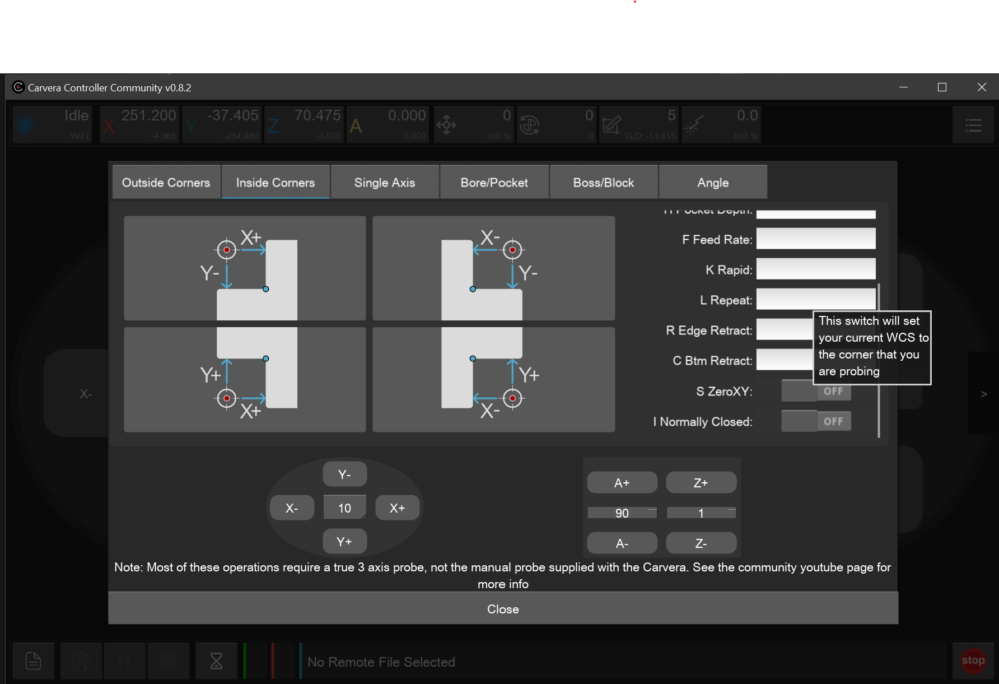<figcaption>
3D Probe Inside Corner
</figcaption></figure>

<figure><figcaption>
3D Probe Inside Corner
</figcaption></figure>

<figure>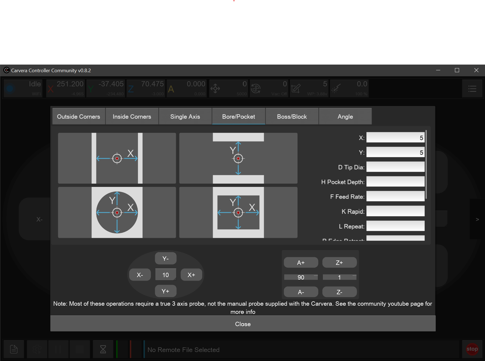<figcaption>
3D Probe Pocket
</figcaption></figure>

<figure>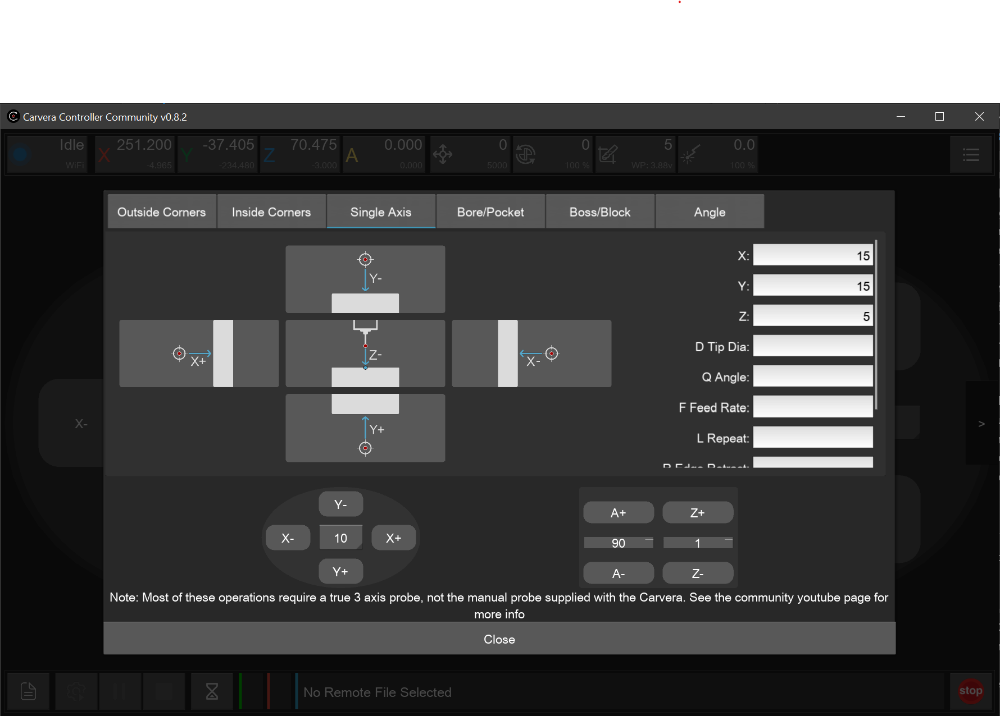<figcaption>
3D Probe Single axis
</figcaption></figure>

<figure>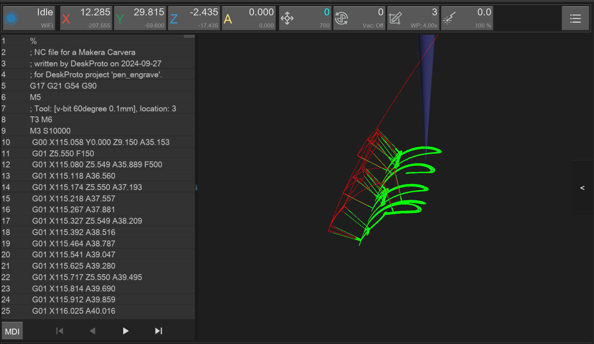<figcaption>
3D Visualisation
</figcaption></figure>

<figure>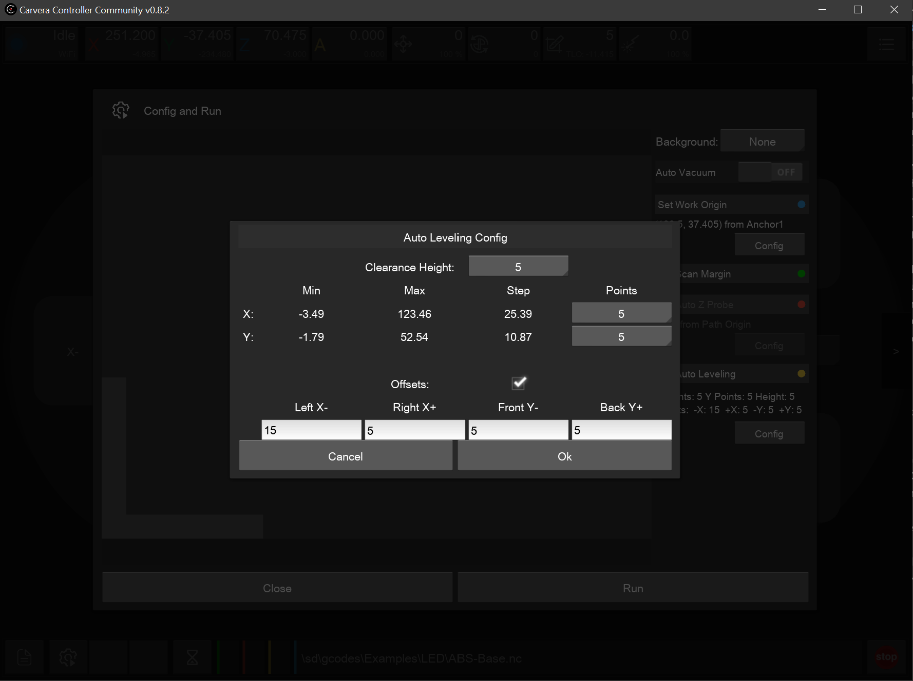<figcaption>
Autolevel with Offset Config
</figcaption></figure>

<figure>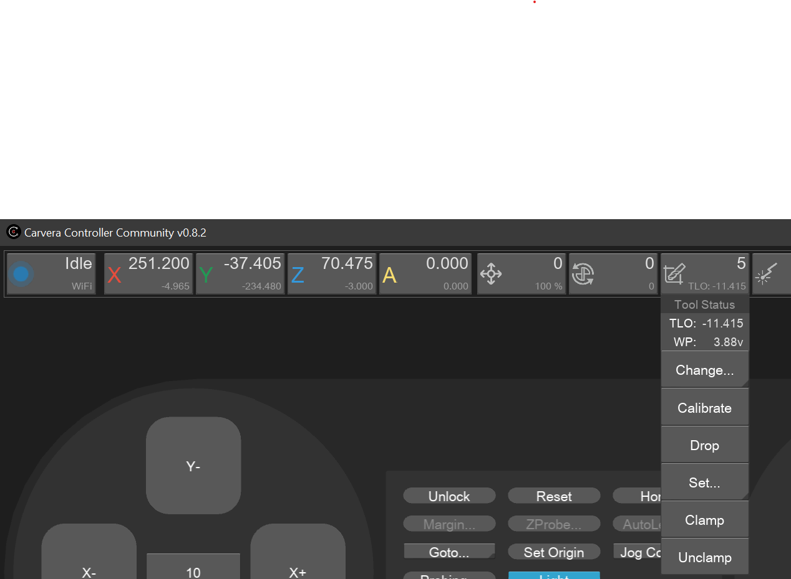<figcaption>
Collet clamp dropdown
</figcaption></figure>

<figure>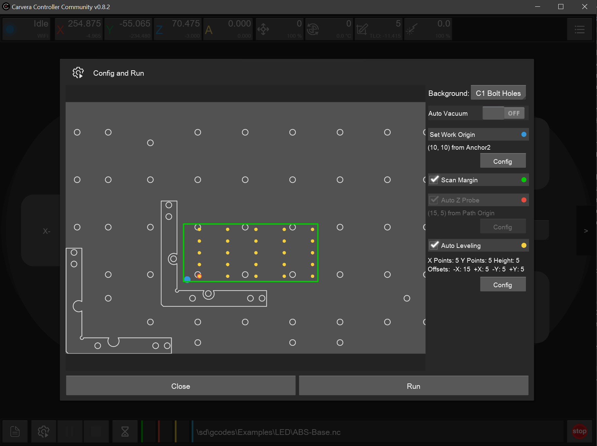<figcaption>
Config and Run with Offsets and Background Image
</figcaption></figure>

<figure>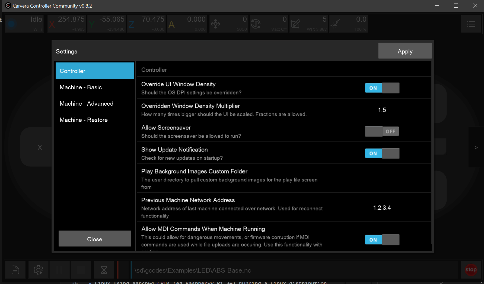<figcaption>
Controller Settings
</figcaption></figure>

<figure>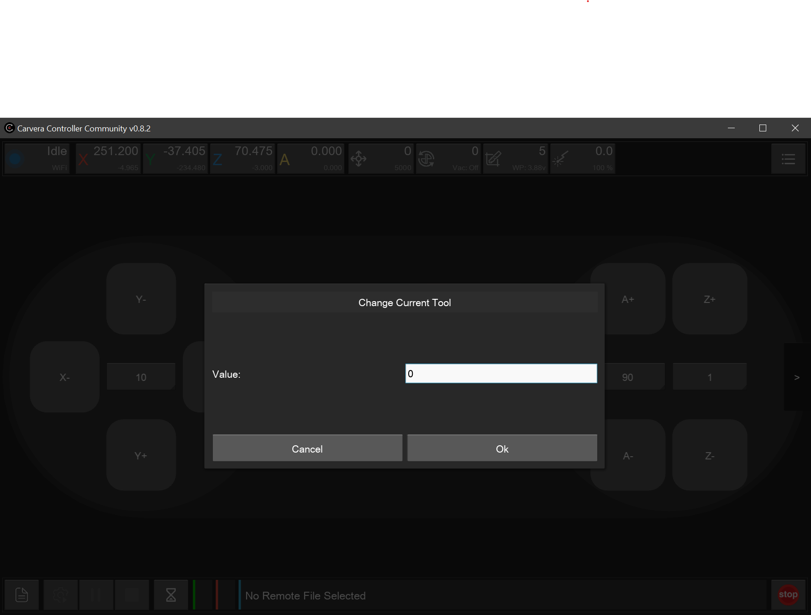<figcaption>
Custom Tool Numbers
</figcaption></figure>

<figure>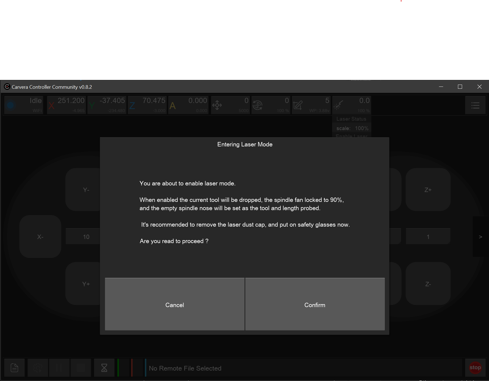<figcaption>
Laser Safety Prompt
</figcaption></figure>

<figure><figcaption>
Reconnect Button
</figcaption></figure>

<figure>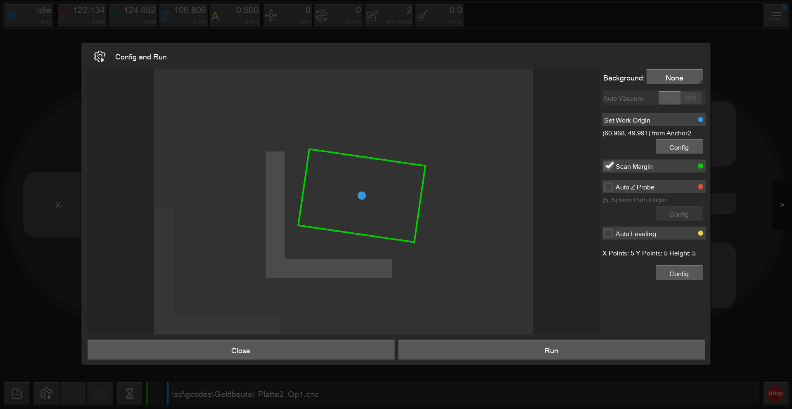<figcaption>
Rotated WCS Support in Config and Run preview
</figcaption></figure>

<figure><figcaption>
Unlock and Move to Safe Z
</figcaption></figure>

<figure>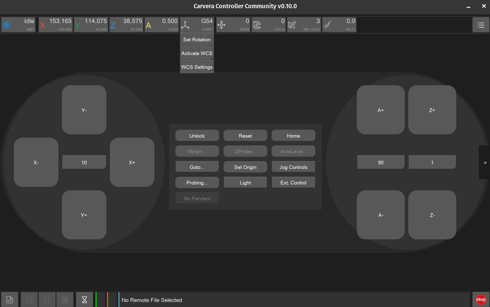<figcaption>
Workspace Management Top Bar
</figcaption></figure>

<figure>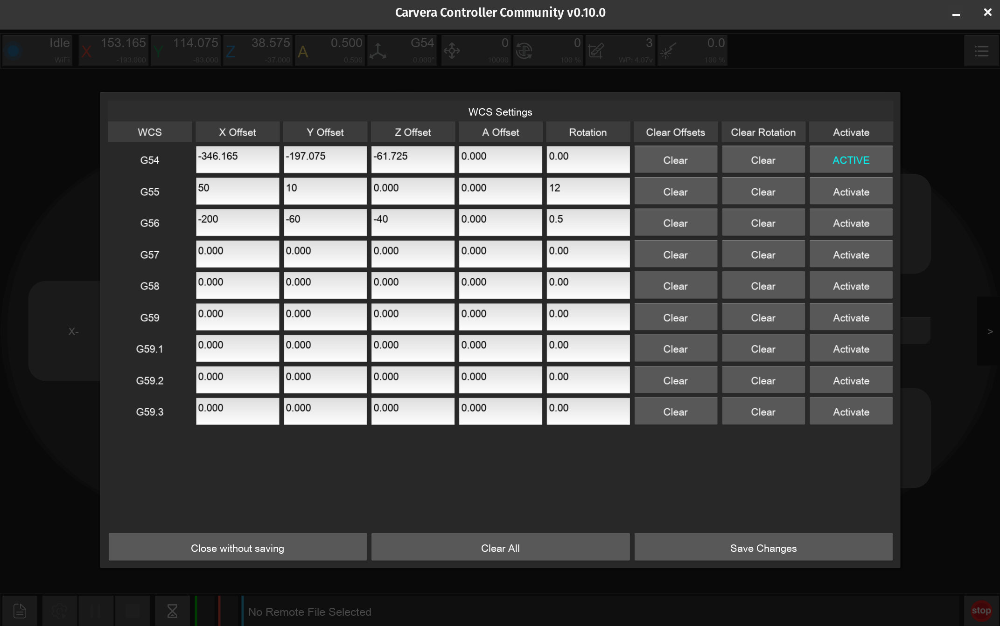<figcaption>
Workspace Settings
</figcaption></figure>

<figure>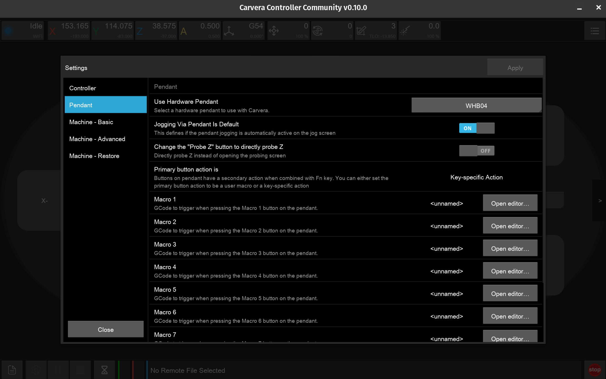<figcaption>
Pendant Config
</figcaption></figure>

<figure>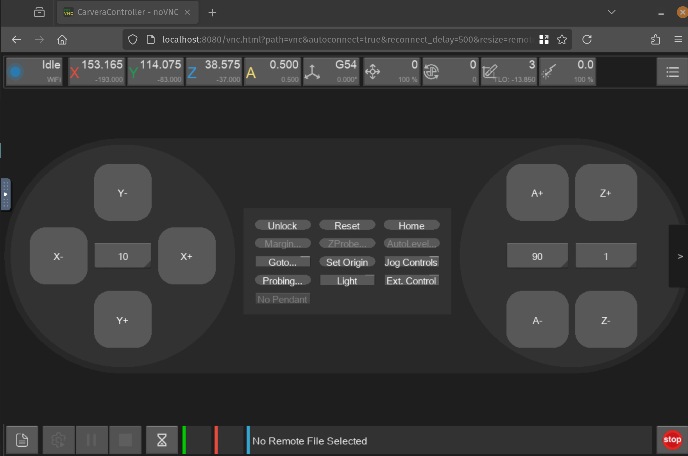<figcaption>
Carvera Controller in a Web Browser (via Container)
</figcaption></figure>
