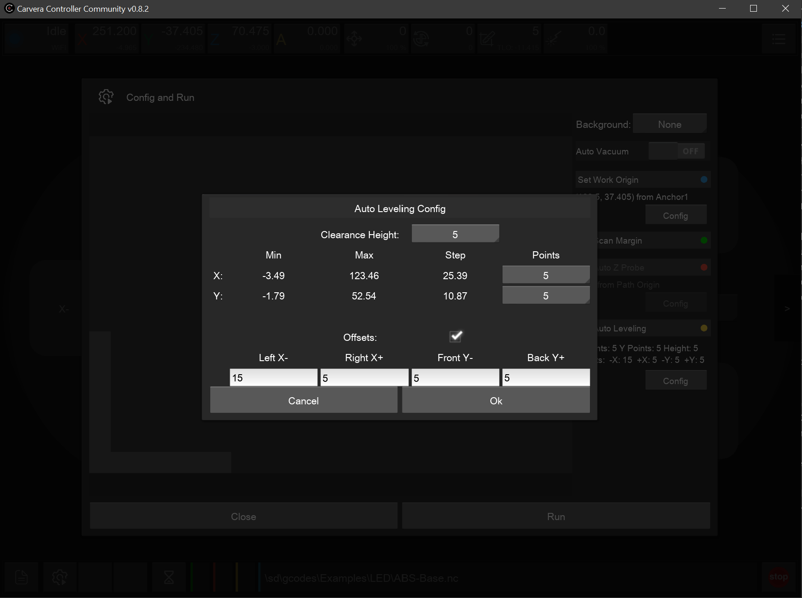

# Auto-Leveling

The Controller **Auto Level** feature probes a grid over the stock or bed and leaves bed-leveling compensation on so later cuts follow the measured surface. This is used for measuring an surface that is known to be imperfect, and retaining this imperfections. This is useful for engraving and PCB milling.

Community Controller can **shrink the probe area** (offsets) so the grid skips clamps, screws, or the tool rack. That setting is on the auto-level configuration screen:

<figure><figcaption>
Autolevel with offset config
</figcaption></figure>
