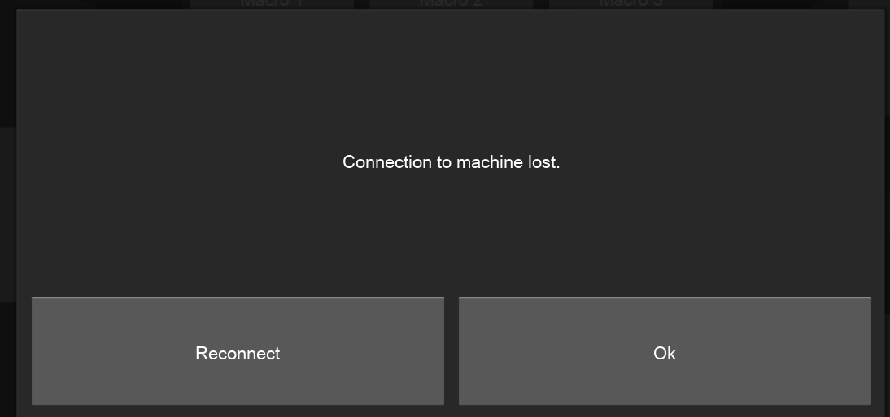
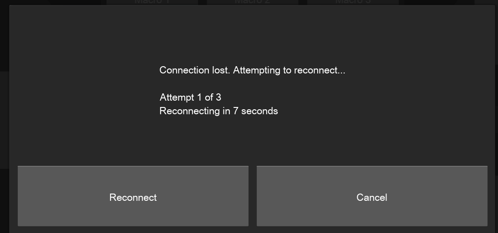

# Auto-Reconnect

If the Controller loses connection to the machine for a reason other than the operator disconnecting it, the software can attempt to reconnect automatically.

## Configuration

The auto-reconnection settings are found in **Settings** , in the **Controller** section:

<figure><figcaption></figcaption></figure>

## Usage

When disconnected and auto-reconnect is not enabled this error prompt is given: 

<figure><figcaption></figcaption></figure>

When disconnected and auto-reconnect is enabled you get a count down like this:

<figure><figcaption></figcaption></figure>
