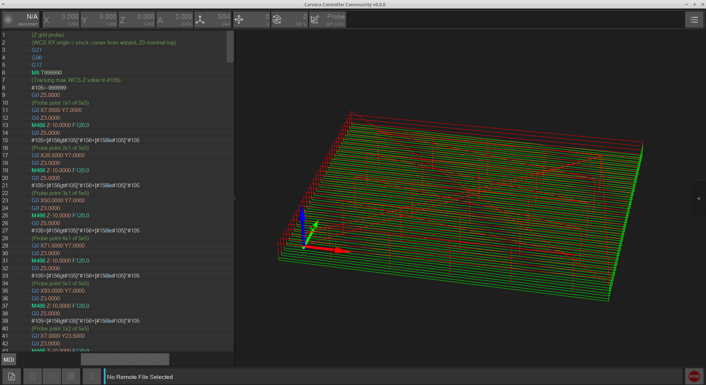
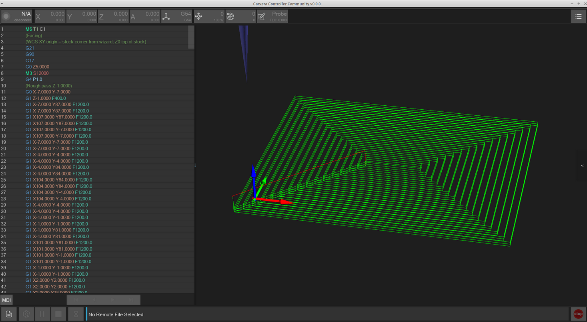
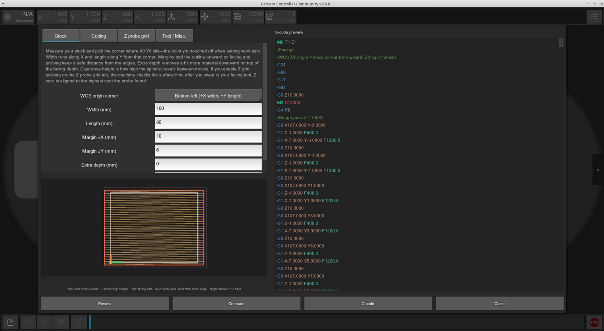
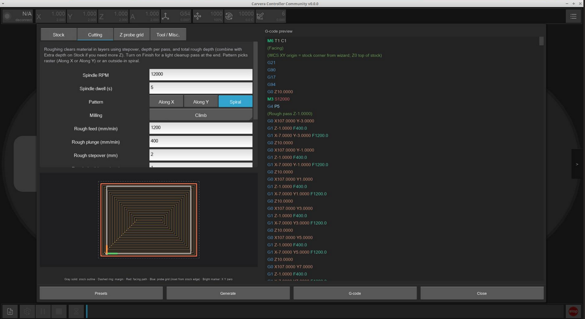
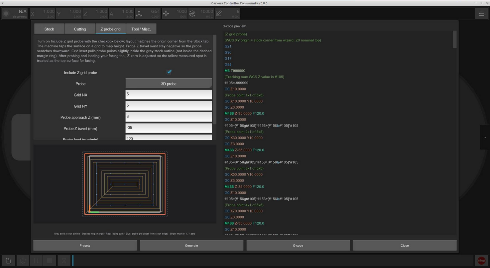
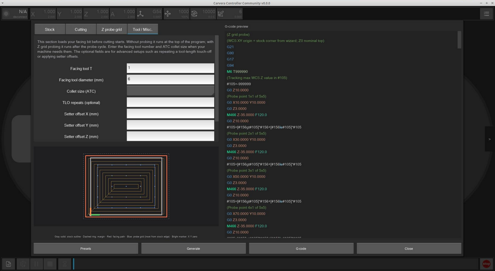
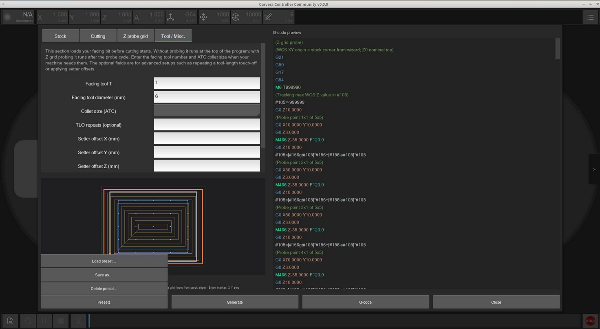
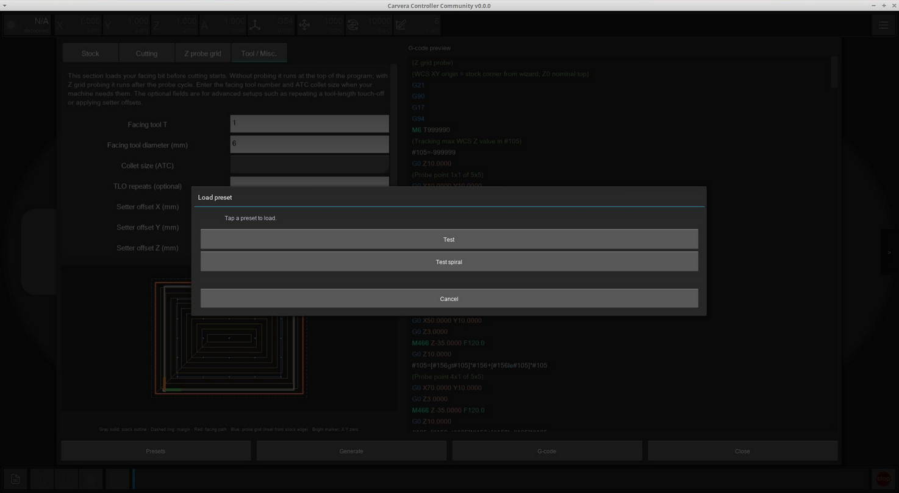
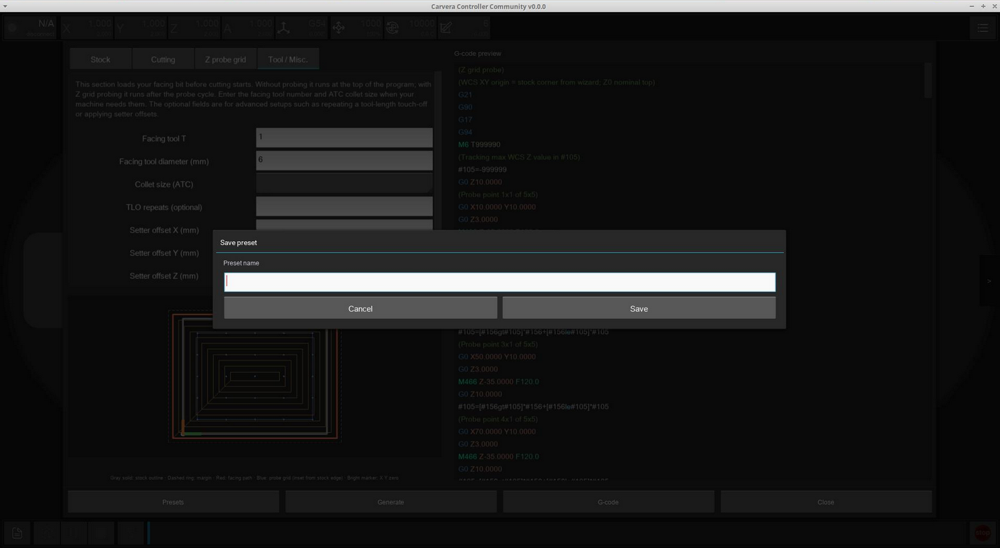
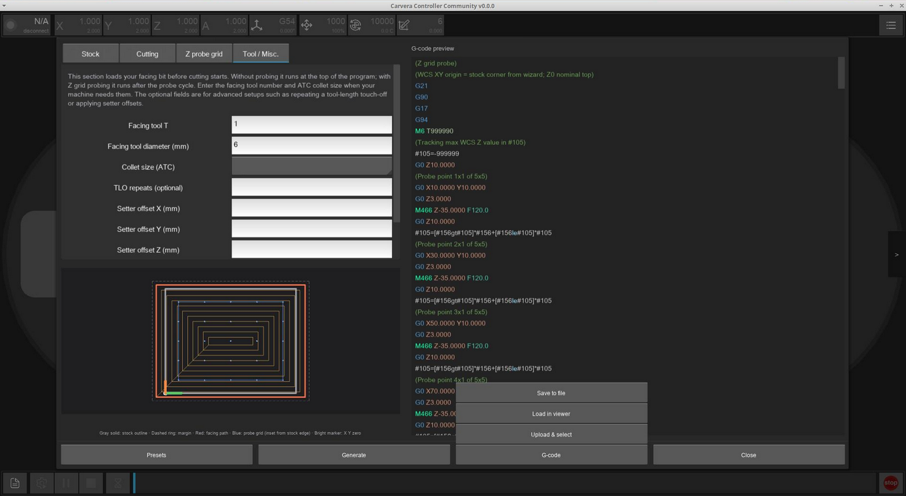

# Facing Wizard

The wizard takes a number of inputs and generates a facing toolpath for you without you needing to open a CAM.

If the Z-grid probing option is used, the wizard will find the highest point on the stock and use that as the starting point.

You can open the Facing wizard from the Tools section of the main control page of the Controller UI.

<figure><figcaption></figcaption></figure>

## What it does

* Collects stock size, tool, stepover, depth, milling direction, and related parameters
* Optionally probes a Z grid over the area before facing
* Previews the toolpath envelope and G-code
* Writes a temporary `.nc` you can upload/run like any other file
* Supports load / save / delete presets

Selected probe tool and collet choices are kept when you reopen the wizard.

## Screenshots

<figure><figcaption></figcaption></figure> <figure><figcaption></figcaption></figure> <figure><figcaption></figcaption></figure> <figure><figcaption></figcaption></figure> <figure><figcaption></figcaption></figure> <figure><figcaption></figcaption></figure> <figure><figcaption></figcaption></figure> <figure><figcaption></figcaption></figure> <figure><figcaption></figcaption></figure> <figure><figcaption></figcaption></figure>

