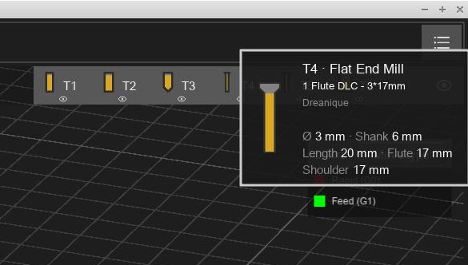
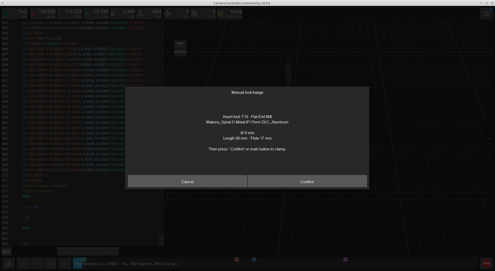
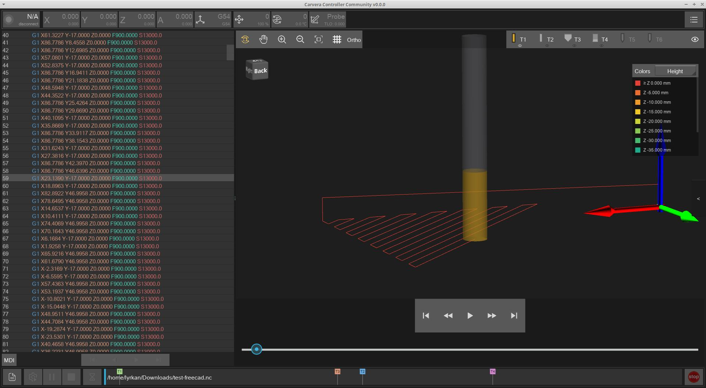
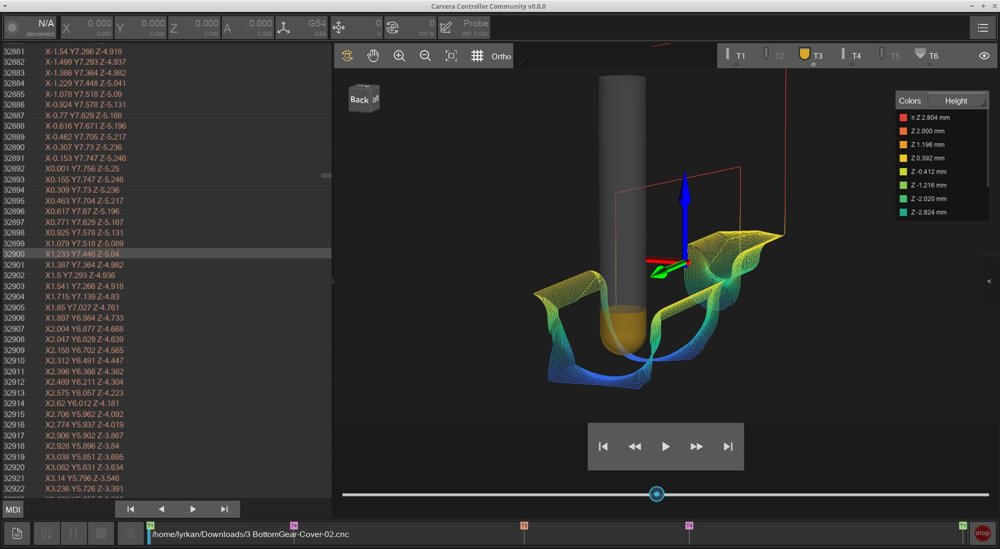
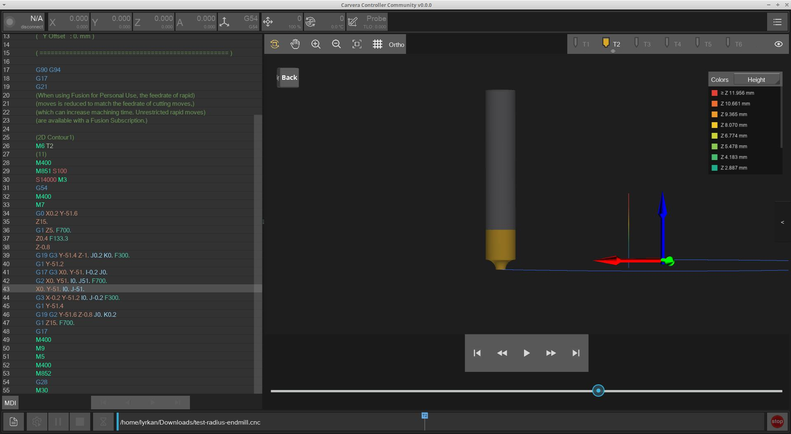
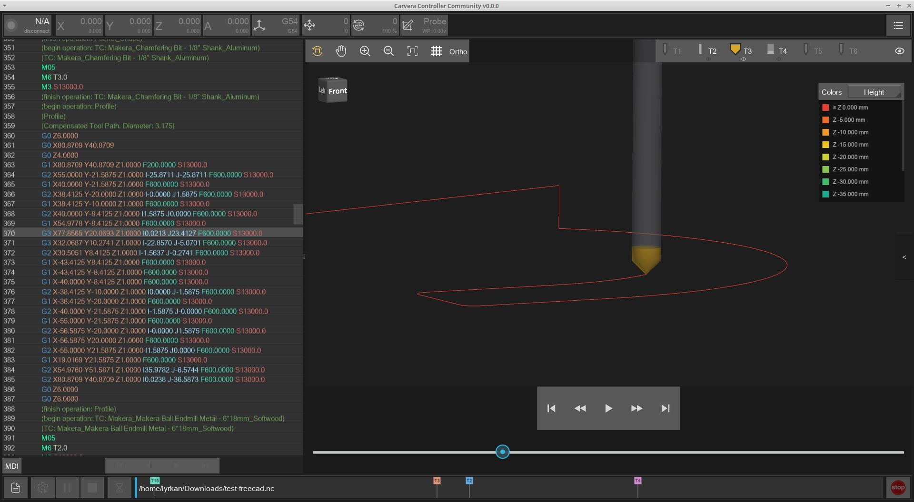
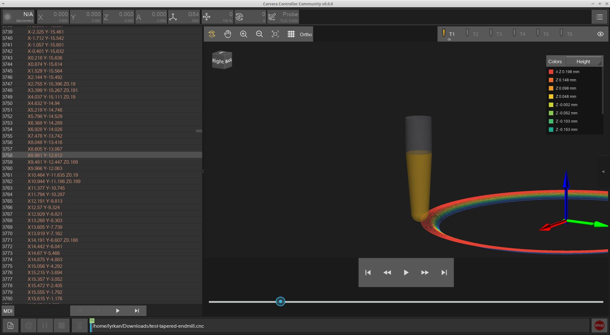
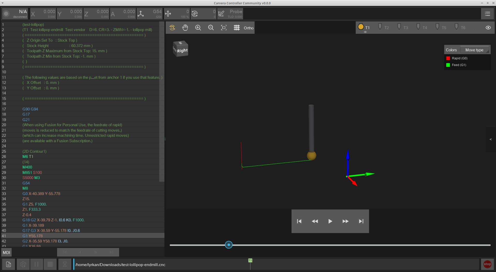
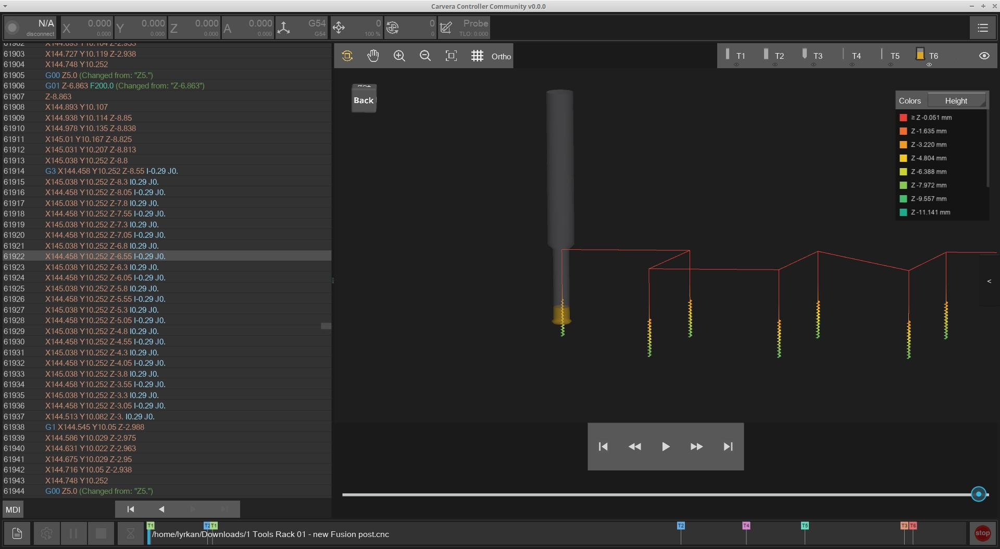

# G-Code Viewer

A number of enhancements are present on the G-Code Viewer page:

* View Controls
* File Viewer
* Playback progress
* Tool visualization
* Z1 camera

<figure><figcaption></figcaption></figure>

## View controls

Toolbar options include:

* **View cube** — click a face to orient the camera
* **Orthographic projection** — toggle perspective vs ortho
* **Grid** — machine grid overlay (visibility is remembered)
* **Color scheme** — colour by move type, tool, feed speed, or Z height (with legend)

The view fits the path bounding box.

<figure><figcaption></figcaption></figure>

## File viewer

The text G-code view supports syntax highlighting for G/M codes, comments, and O-code / math constructs.

<figure><figcaption></figcaption></figure>

Syntax highlighting colours can be customised in the Controller settings:

<figure><figcaption></figcaption></figure>

## Playback progress

Tool-change locations can be shown as markers on the playback progress bar. Toggle under Controller settings (`show_playbar_tool_change_markers`).

<figure><figcaption></figcaption></figure>

## Tool visualization

The viewer reads tool definitions from comments written by supported CAM post-processors and uses them for a more accurate 3D tool mesh, toolbar icons, hover tooltips, and the manual tool-change popup text.

Supported sources:

* Fusion 360 (Carvera Community post-processor)
* Makera Studio
* FreeCAD (Carvera Community post-processor)

When at least one tool definition is found, tool icons appear in the viewer toolbar (space permitting). Hover a tool for diameter, length, flute/shoulder, and related details. Manual tool-change prompts include the same summary so you know which cutter to load.

If no definition is present for a tool, a generic mesh is used.

<figure><figcaption>
Tool tooltip on hover
</figcaption></figure>

<figure><figcaption>
Manual tool-change popup with tool details
</figcaption></figure>

### Screenshots

<figure><figcaption></figcaption></figure> <figure><figcaption></figcaption></figure> <figure><figcaption></figcaption></figure> <figure><figcaption></figcaption></figure> <figure><figcaption></figcaption></figure> <figure><figcaption></figcaption></figure> <figure><figcaption></figcaption></figure>

## Z1 camera

On a Makera Z1 connected over WiFi, the Controller supports viewing the built-in camera. When found, a camera button appears in the G-code viewer toolbar.

<figure><figcaption>
Camera Viewer
</figcaption></figure>

Tap it to start or stop the live stream. While streaming, the configure panel offers:

* **Resolution** — changeable live (640×480 default; also 800×600, 1024×768, 1280×720, 1280×1024, 1600×1200). Higher sizes may run at a lower frame rate depending on the quality of the wifi connection.
* **Brightness**, **Contrast**, **Gamma** adjustment
