# G-Code Viewer

A number of enhancements are present on the G-Code Viewer page:

* View Controls
* File Viewer
* Playback progress
* Tool visualization
* Ghost display
* Bed visualization
* Stock simulation
* Selected line explanation
* Playback progress

<figure><figcaption></figcaption></figure>

## View controls

Toolbar options include:

* **View cube** - click a face to orient the camera
* **Orthographic projection** - toggle perspective vs ortho
* **Grid** - machine grid overlay (visibility is remembered)
* **Ghost Display -** Makes older toolpaths faint, and recent toolpaths solid
* **Stock Simulation -** Simulations the stock material being cut
* **Bed Visualisation -** Adds the machine bed to the visualisation&#x20;

<figure><figcaption></figcaption></figure>

## File viewer

The text G-code view supports syntax highlighting for G/M codes, comments, and O-code / math constructs.

<figure><figcaption></figcaption></figure>

Syntax highlighting colours can be customised in the Controller settings:

<figure><figcaption></figcaption></figure>

## Playback progress

Tool-change locations can be shown as markers on the playback progress bar. Toggle under Controller settings (`show_playbar_tool_change_markers`).

<figure><figcaption></figcaption></figure>

## Tool visualization

The viewer reads tool definitions from comments written by supported CAM post-processors and uses them for a more accurate 3D tool mesh, toolbar icons, hover tooltips, and the manual tool-change popup text.

Supported sources:

* Fusion 360 (Carvera Community post-processor)
* Makera Studio
* FreeCAD (Carvera Community post-processor)

When at least one tool definition is found, tool icons appear and their descriptions appear as a list in the upper right of the view. Hover a tool for diameter, length, flute/shoulder, and related details. Manual tool-change prompts include the same summary so you know which cutter to load.

If no definition is present for a tool, a generic mesh is used.

<figure><figcaption></figcaption></figure>

<figure><figcaption>
Hovering over a tool shows more information
</figcaption></figure>

<figure>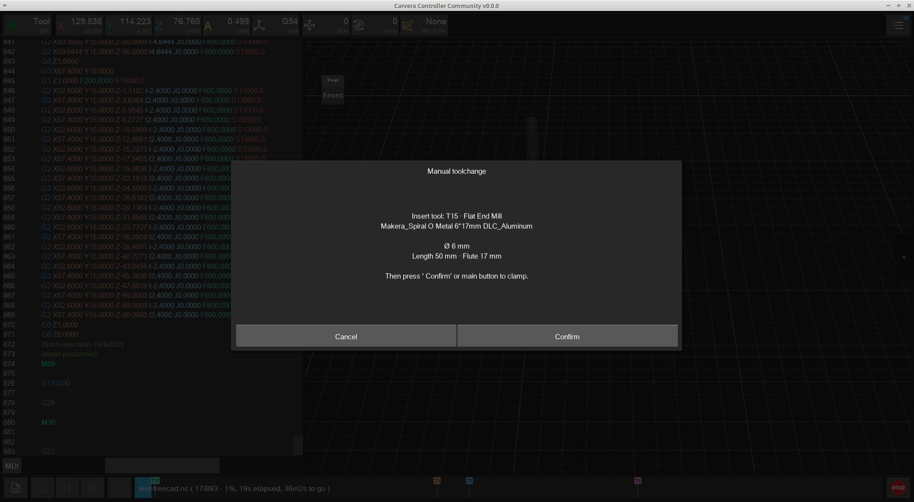<figcaption>
Manual tool-change popup with tool details
</figcaption></figure>

### Screenshots

<figure>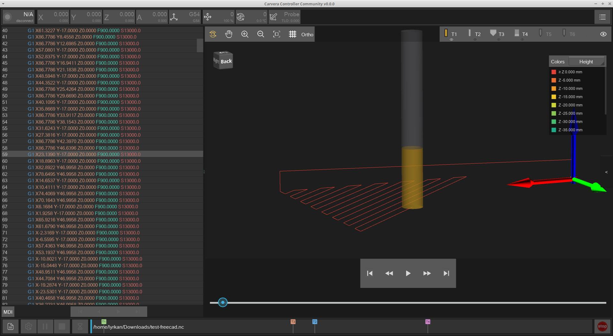<figcaption></figcaption></figure> <figure>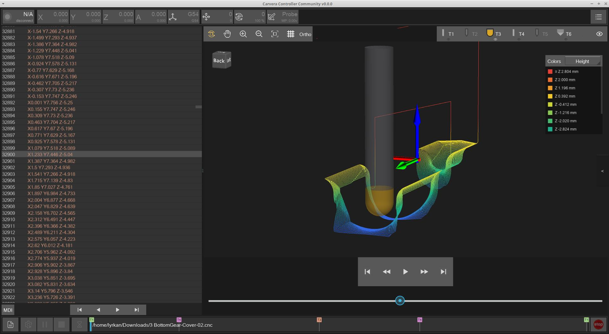<figcaption></figcaption></figure> <figure>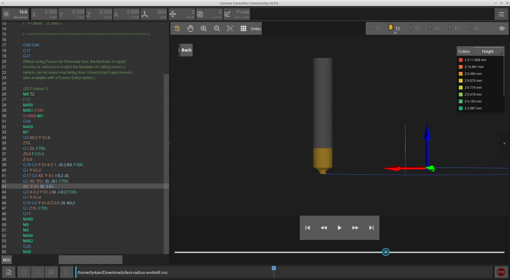<figcaption></figcaption></figure> <figure>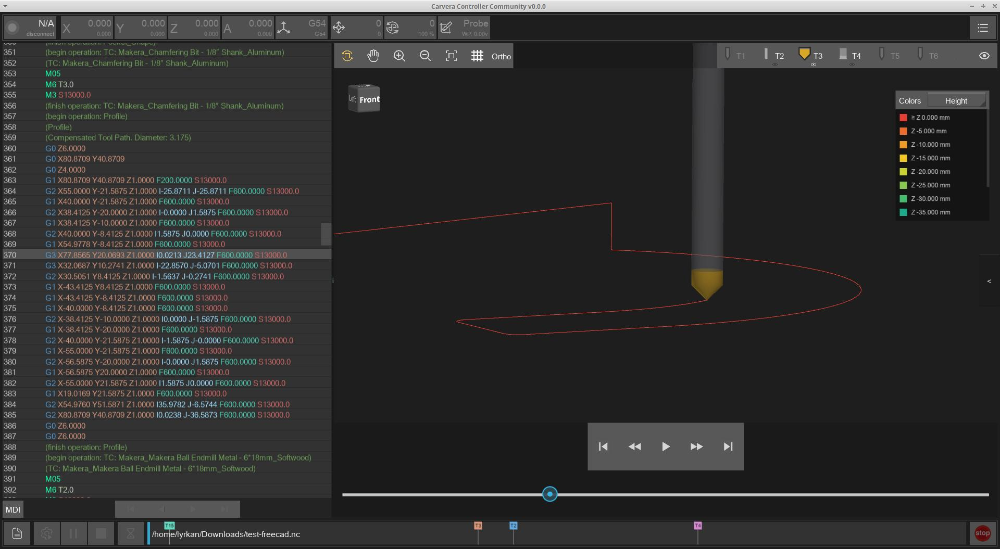<figcaption></figcaption></figure> <figure>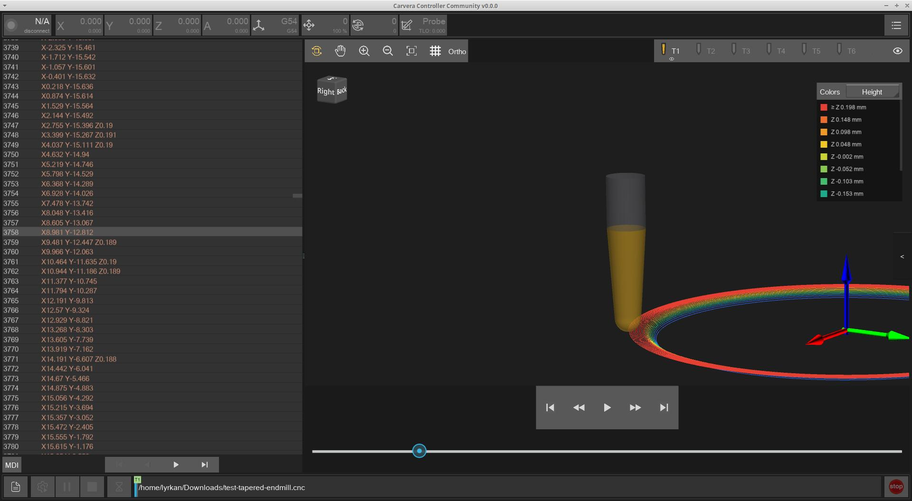<figcaption></figcaption></figure> <figure>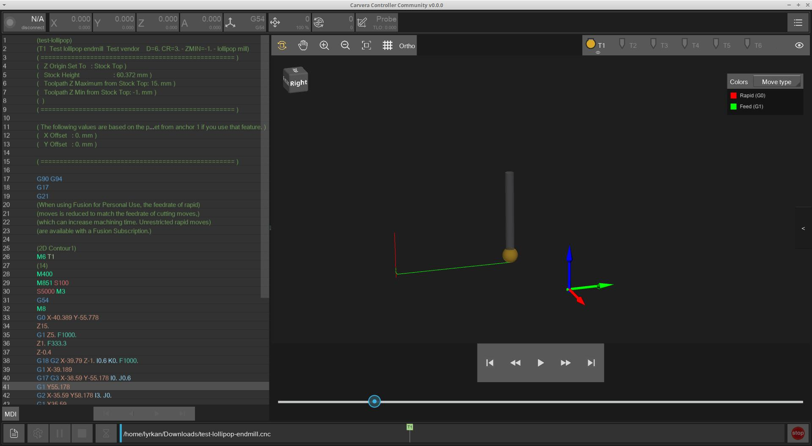<figcaption></figcaption></figure> <figure>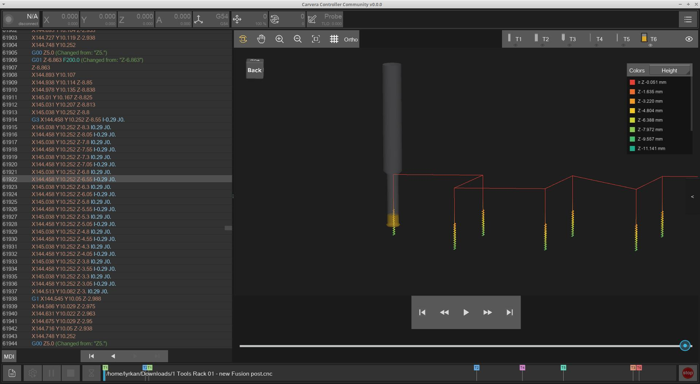<figcaption></figcaption></figure>

## Ghost display

The **Ghost** display mode makes older toolpath moves faint and draws recent moves at full opacity. This creates a trailing highlight that follows the playback position, making it easier to see where the tool is and where it has been.

<figure>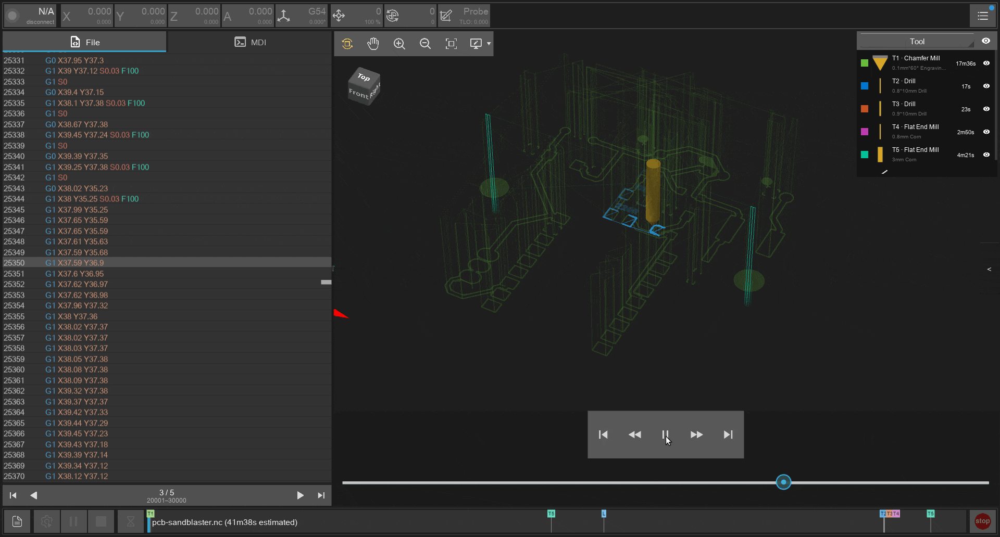<figcaption></figcaption></figure>

## Bed visualization

A machine bed model can be shown behind the toolpath in the 3D viewer. The bed button on the toolbar opens the bed settings where you can:

* **Select a bed** — choose from built-in beds for the Carvera C1, Carvera Air, and Makera Z1, or add a custom bed
* **Add / delete** custom beds — import your own fixture-plate or vice model
* **Position the bed** relative to the machine origin

<figure>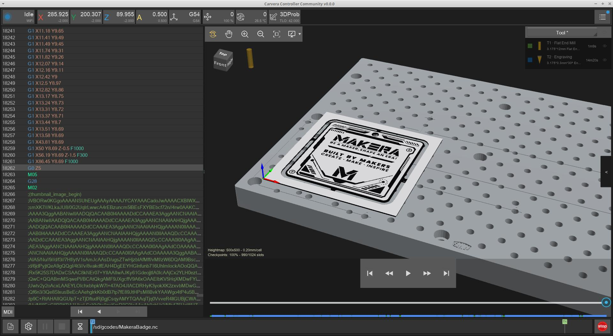<figcaption></figcaption></figure>

## Stock simulation

The viewer can simulate how the loaded toolpath carves into stock for a 3D preview of the finished part. See the dedicated [Stock Simulation](stock-simulation.md) page for full details.

<figure>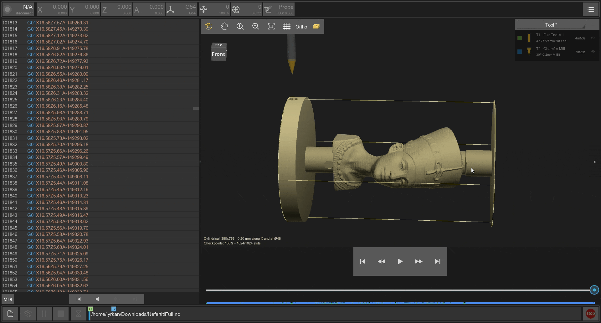<figcaption></figcaption></figure>

## Intellisense

Hovering over or selecting a line in the G-code file viewer shows an **Intellisense-like popup** explaining the commands on that line. The same popups appear while typing in the [MDI Terminal](mdi-terminal.md).

Recognised commands include G-codes, M-codes, and console (SimpleShell) commands. Each popup shows the command name, a short description, and parameter details.

<figure><figcaption></figcaption></figure>

## Time estimates

The progress bar shows the estimated total run time after a file is selected (before the job starts). During playback, tool-change flags along the bar have **hover tooltips** showing the time remaining until each tool change. The remaining-time text in the bar alternates between time to the next tool change and time to job completion.

<figure><figcaption></figcaption></figure>
