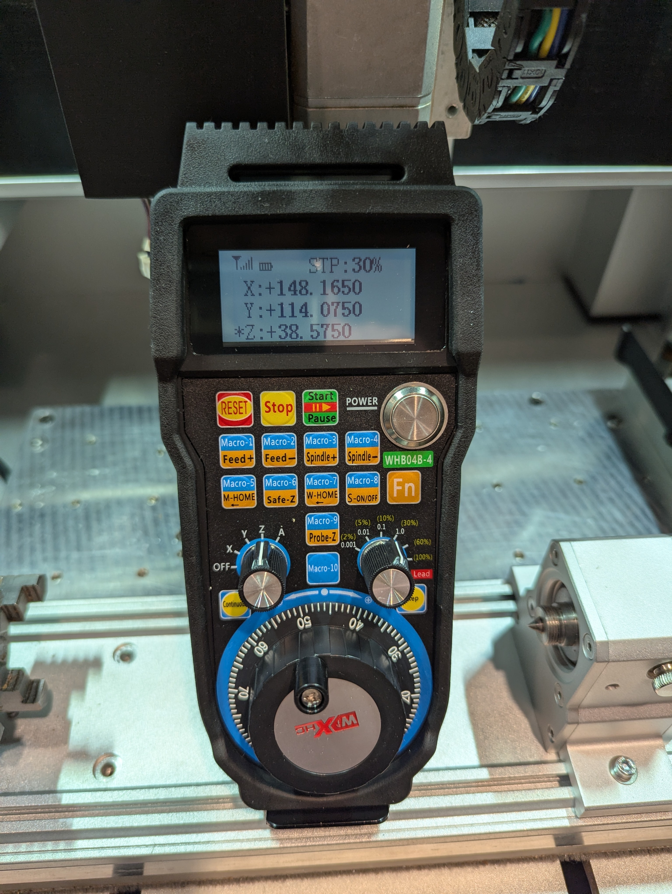

# Pendant Support

The Community Controller supports the [WiXHC WBH04](https://www.wixhc.cn/product/4-axis-usb-cnc-controller-whb04b-4) family of pendants to control the machine. They can be purchased from [AliExpress](https://www.aliexpress.com/item/1005006270475983.html) or from other online retailers. There are a number of variations within this family of devices, including 4/6 axis models, and wired/wireless. All them are expected to work with the Community Controller.&#x20;


This functionality is supported on Windows, MacOS and Linux. It is not available for iOS or Android.


<figure><figcaption><p>Pictured is a 4 axis, wireless WBH04</p></figcaption></figure>

## Configuration

### Possible Configuration Options

The following is a screenshot of the Pendant configuration screen, showing all the possible options:

<figure><figcaption></figcaption></figure>

### Enable Integration

To enable the WBH04 pendant support in the Controller:

1. Plug the Pendant receiver (if wireless) or Pendant USB cable into the computer that will run the Controller software. No drivers are required.
2. Open the Controller and browse to the Settings screen.&#x20;
3. In the Pendant section of Settings select the "Use Hardware Pendant" dropdown, and choose the WHB04 option. This option will only be present if a WHB04 type device is connected to the computer.
4. Apply the Setting. The pendant can now be used.&#x20;

### Setting a Primary Action on the Pendant

The WBH04 pendant devices have action buttons which can also be set to run Macros. In the Pendant configuration screen is the setting _**`Primary button action is`**_ which defines what happens when the button is pressed. This can be _**Key-specific Action**_ or _**Macro**_. The opposite of this setting is what will occur when the button is pressed at the same time as the _**FN**_ key.

For example if the _**`Primary button action is` setting is set to Key-specific Action**_, pressing the keywill increase the Feed override by 10%. Pushing the + will run Macro #1.

For example if the _**`Primary button action is` setting is set to Macro**_, pressing the keywill run Macro #1. Pushing the + will run increase the Feed override by 10%

### Setting Macros

The pendant supports configuration of up to 10 macros. These macros are short snippets of gcode which will be executed when the corresponding Macro buttons are pressed.

These can be configured in the Settings->Pendant screen by clicking the UI button corresponding to the Macro number.

This will bring up the Macro edit screen:

<figure><figcaption></figcaption></figure>

## Usage

To jog with the pendant you must have the  enabled on the main control screen. The button is blue when pendant based jogging is enabled. The action/macro buttons will work irrespective if  is enabled or not.

<figure><figcaption></figcaption></figure>

## Linux&#x20;

To use the pedant in Linux your system needs the `libhidapi-hidraw0` package.

#### Linux device permissions

To use the pendant in Linux, you need to grant your user access to the USB device. Most Linux distributions (Ubuntu/Debian/Fedora) automatically add users to the `plugdev` group, so the easiest and most secure approach is to create a udev rule that grants this group access to the device.

Run this command to create the udev rule:

```
sudo sh -c 'echo "SUBSYSTEM==\"hidraw\", ATTRS{idVendor}==\"10ce\", ATTRS{idProduct}==\"eb93\", GROUP=\"plugdev\", MODE=\"0660\"" > /etc/udev/rules.d/90-xhc.rules'
```

After creating the rule, you may need to reload the udev rules:

```
sudo udevadm control --reload-rules
sudo udevadm trigger
```

## Known Limitations

There are a number of known limitations to the WBH04 pendant/integration.

### Movement step is shown as % on LCD

<figure><figcaption></figcaption></figure>

The pendant LCD screen always shows the movement step (STP) as a %, however the actual movement size per rotary dial "click" is defined by the white text in mm:

<figure><figcaption></figcaption></figure>

### Step/Continuous Buttons don't do anything

&#x20;Currently the machine firmware doesn't support continuous jogging mode, thus the jog movements are always done in steps based on the speed selected by the movement dial. The step/continuous buttons don't do anything when pushed

### Small movements appear to "cog"

Due to a number of factors relating to command queue processing on the machine whenever the machine moves from standstill there are a few millisecond pauses between movement steps compared to when multiple jog steps are "enqueued". No steps are missed.

### Invalid Axis Values

When the Axis selector is set to Off or the Controller has not yet connected to the machine, the axis position values on the Pendant screen can display incorrect values.&#x20;
