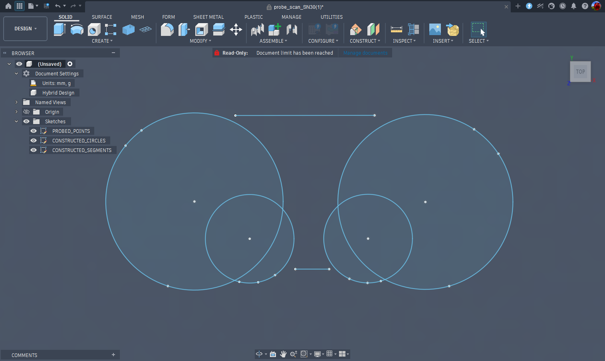
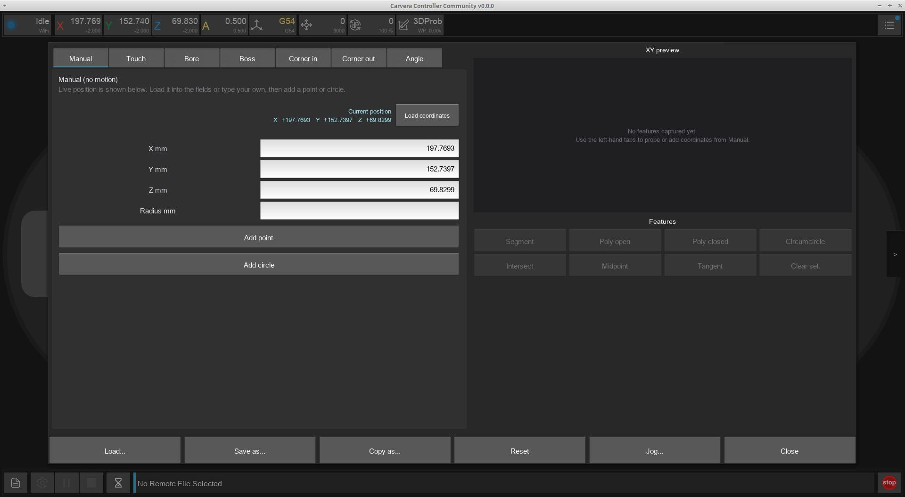
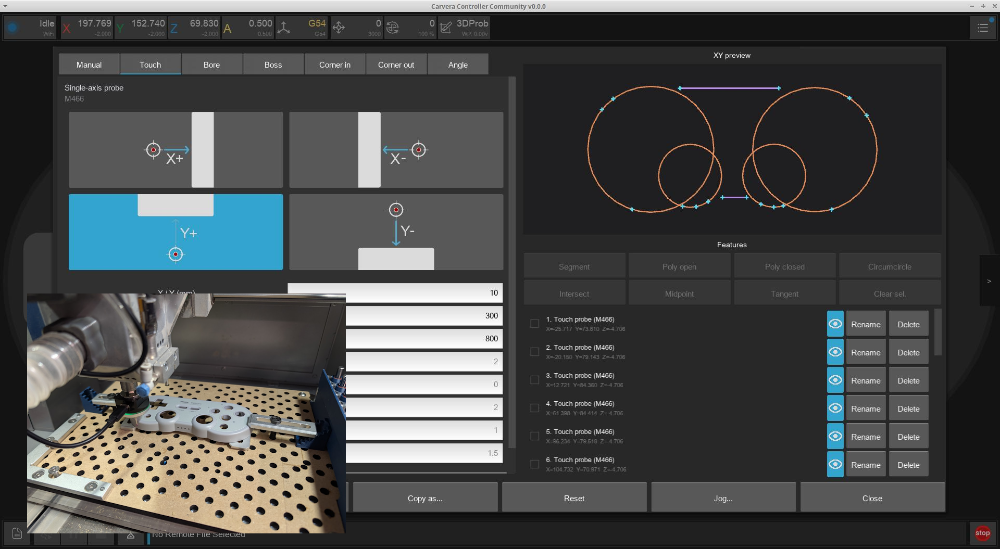
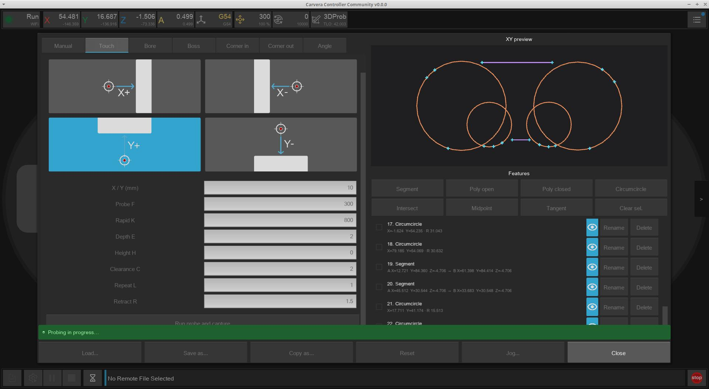
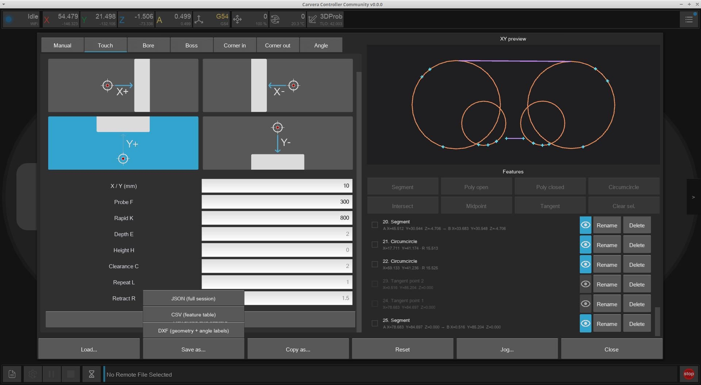
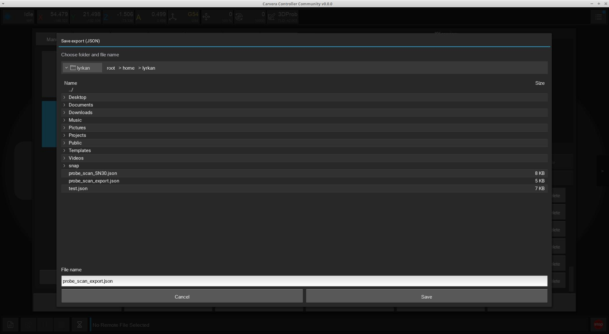
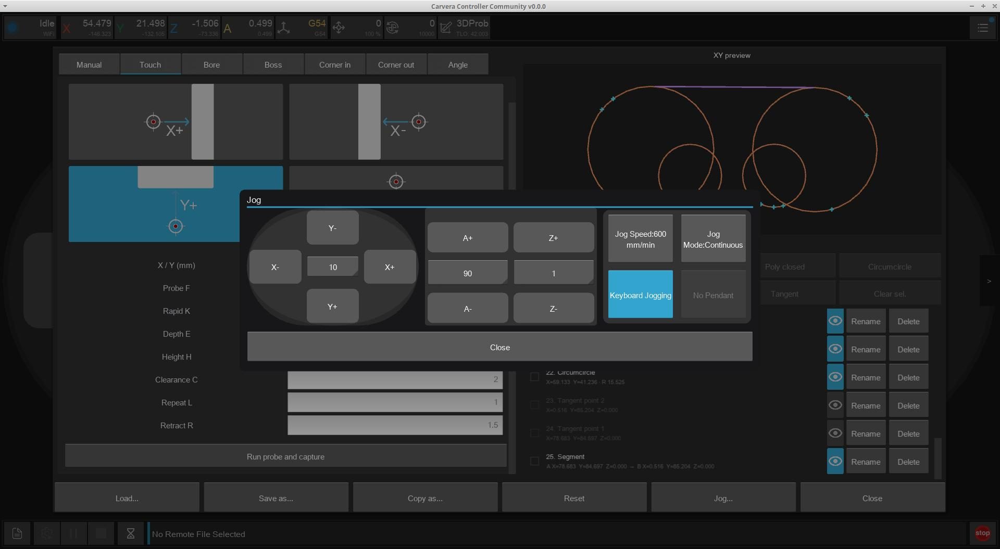

# Probe Scan

CMM-style probing tool for building a 2D sketch of probed and constructed features, then exporting the result as design file. Basically a way of using a 3D Probe to reverse engineer physical objects.


A 3D probe is required for X/Y side probing. The stock machine probe only works in Z.


You can open Probe Scan from the Tools section of the main control page of the Controller UI.

<figure><figcaption></figcaption></figure>

## Workflow

1. Jog / position the probe as usual (keyboard jogging is available while the modal allows it).
2. Run a probe operation (outside/inside corner, bore, boss, single-axis, angle, and related macros). Results are captured into the feature list.
3. Construct derived geometry from selected features: segments, polylines, midpoints, intersections, tangents, circumcircles, and so on.
4. Optionally hide features in the 2D sketch without deleting them.
5. Export CSV / DXF / JSON, or load a previous scan (DXF/CSV).


Save/Load is disabled on iOS currently.


## Notes

* Probe tip diameter can be set in the tool; the UI also shows the machine’s configured tip diameter.
* Probed angles can appear as labels on the sketch.
* Cancel / timeout ignores stale probe results so a late reply does not corrupt the session.

## Screenshots

<figure><figcaption></figcaption></figure> <figure><figcaption></figcaption></figure> <figure><figcaption></figcaption></figure> <figure><figcaption></figcaption></figure> <figure><figcaption></figcaption></figure> <figure><figcaption></figcaption></figure> <figure><figcaption></figcaption></figure>

