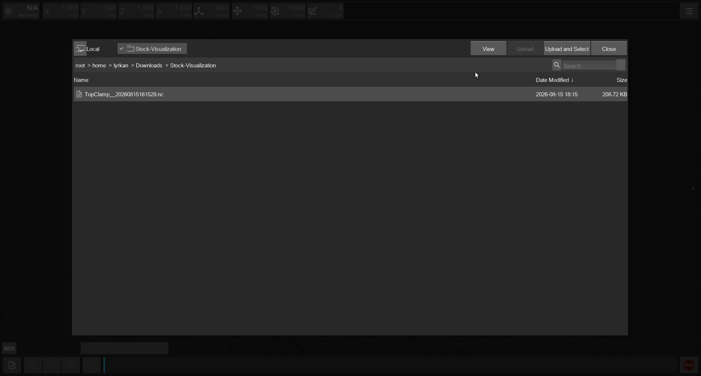
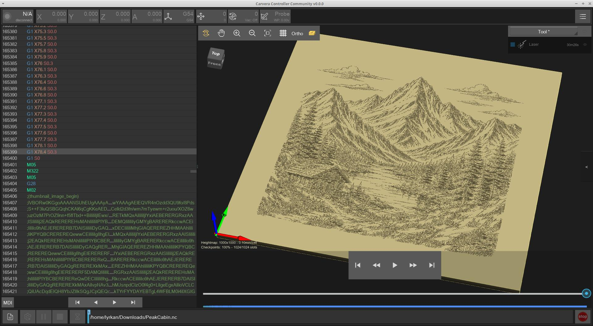

# Stock Simulation

The G-Code viewer can simulate how the loaded toolpath carves into a block of stock, giving you a 3D preview of the finished part before running the job.

## Enabling Stock Simulation

<figure><figcaption>
Stock simulation in action
</figcaption></figure>

Open the stock settings from the G-Code viewer toolbar. From here you can configure:

* **Stock dimensions** - width, depth, height (or diameter and length for cylindrical stock)
* **Stock origin** - where the WCS origin sits on the stock (a 3×3 grid of corner/edge/centre choices)
* **Material** - visual material preset for the rendered stock
* **Simulation quality** - resolution of the carving engine (low / medium / high)
* **Simulate while playing** - update the carved mesh live during playback

Stock size and origin are auto-detected from comments embedded by supported CAM post-processors:

* Fusion 360 (Carvera Community post-processor)
* Makera Studio
* FreeCAD (Carvera Community post-processor)

If no stock comments are found, the viewer estimates a bounding box from the G-code extents. The estimated size uses the min/max X and Y coordinates with an offset based on the largest tool diameter. For Z, the 95th-percentile cutting depth is used instead of the absolute maximum to avoid inflating the stock with retraction or clearance moves.

The **Automatically display stock when available** setting in Controller settings tells the viewer to show the stock shell whenever a compatible file is loaded.

## Carving Engines

The simulator selects a carving engine automatically based on the job type and tools. You can also override the selection manually.

| Engine          | Best for                                 | How it works                                                              |
| --------------- | ---------------------------------------- | ------------------------------------------------------------------------- |
| **Heightmap**   | 3-axis jobs without undercuts            | Fast 2D height array; one Z value per cell                                |
| **Cylindrical** | 4th-axis wrapping jobs                   | Radial dexel array in (X, θ) space for outside-in turning                 |
| **Voxel**       | Jobs with undercuts or off-axis 4th-axis | Full 3D grid; accurate for re-entrant tool profiles at higher memory cost |

When set to **Auto** the simulator picks **Heightmap** for standard 3-axis files, **Cylindrical** for rotary wrapping jobs, and **Voxel** when any tool has an undercut profile (such as a lollipop endmill, dovetail, or thread mill) or when Y-axis moves are present in a 4th-axis file.

### Heightmap carver

The heightmap carver stores a 2D grid where each cell holds the current surface height of that column. During simulation each cutting move lowers the affected cells to the tool's depth at that position. Because there is only one height per cell it cannot represent undercuts, but it is the fastest engine and uses the least memory. It is the default choice for 3-axis jobs with no undercut-capable tools.

### Cylindrical carver

For 4th-axis wrapping jobs the cylindrical carver uses dexels arranged on the surface of a cylinder in (X, θ) space. The "heights" are measured radially inward from the cylinder surface toward the centre. This means:

* Undercuts cannot be represented (same limitation as the heightmap).
* Carving at negative Z (below the cylinder centre) is not supported.
* Precision is denser toward the centre of the stock and coarser near the surface.

It is the default choice for 4th-axis jobs that have no undercut-capable tools and no off-axis Y moves.

<figure><figcaption></figcaption></figure>

### Voxel carver

The voxel carver represents the stock as a full 3D grid. It takes the longest axis of the stock and divides it based on the quality level target (clamped so voxel size stays between 0.1 mm and 1 mm). For example:

* A 200 × 20 × 10 mm stock at Low quality (100 voxels on the long axis) produces 100 × 10 × 5 voxels of 2 mm each.
* A 50 × 100 × 5 mm stock at High quality (500 voxels on the long axis) produces 250 × 500 × 25 voxels of 0.2 mm each.

### Simulation quality

Quality controls how many cells the engine uses along the stock's reference length:

| Level      | Heightmap | Cylindrical | Voxel |
| ---------- | --------- | ----------- | ----- |
| **Low**    | 200       | 150         | 100   |
| **Medium** | 500       | 400         | 300   |
| **High**   | 1000      | 800         | 500   |

Higher values produce a more detailed carved surface but use more memory and take longer to compute.

## Materials

A material preset changes the surface appearance of the stock and carved surfaces in the 3D view. Available presets:

* **Default** (beige)
* **PCB** - copper-clad board with foil surface and substrate interior
* **Wood**
* **Acrylic**
* **Acrylic (bicolour)** - white surface over dark core
* **Aluminium**
* **Copper**

Materials are visual only and do not affect simulation accuracy.

## 4th-Axis and Laser

* **4th-axis wrapping** jobs render on a cylindrical stock. The simulator auto-selects cylindrical or voxel carving depending on whether off-axis Y moves are present.
* **Laser** jobs are simulated as surface engraving on a flat heightmap.

<figure><figcaption></figcaption></figure>

## Simulate While Playing

When enabled, the carved stock mesh updates live as the machine executes lines. The simulation runs in a background worker thread:

* **While playing** - the worker carves up to the current playback position so the 3D mesh stays in sync with the tool.
* **While paused** - the worker processes ahead of the current position on a second sparse grid, building checkpoints without affecting the live view.

### Playback scrubbing and checkpoints

Scrubbing the playback slider forwards or backwards also updates the carved view. Fully re-simulating from the start of the file every time the slider moves would be too slow, so the simulator maintains a series of checkpoints spread evenly along the toolpath:

* A **full snapshot** is stored every four checkpoints, recording only non-solid clusters.
* **Intermediate checkpoints** store only the clusters that changed since the previous checkpoint (a delta).

When the slider jumps to a new position the simulator restores the nearest preceding checkpoint (one full snapshot plus at most three deltas) and re-carves only the short gap between that checkpoint and the target position. The number of checkpoint slots is configurable (256 / 1024 / 4096) — more slots means less re-carving when scrubbing but higher memory use.
