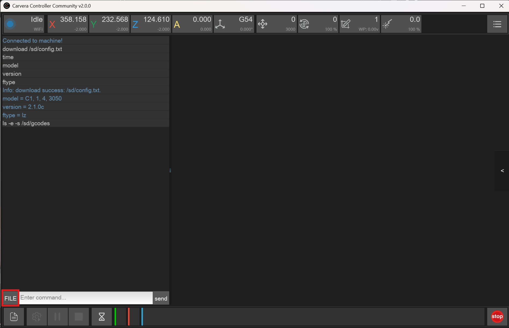

# Custom Tool Setter Position



The location of the tool setter can be customized using the configuration elements `coordinate.probe_mcs_x` and `coordinate.probe_mcs_y`. Normally the location is set by way of reference to the toolrack but setting these two configuration keys you can use a specific MCS location.

The easiest way to set the coordinates is have a tool in the collet, and jog the spindle down so that it's above but not touching the tool setter. In the Controller take note of the MCS X and Y locations. These are the positions in small grey text in the tool bar.

<figure><figcaption><p>Highlighted is the MCS Position of the spindle as shown on the Controller in small grey text</p></figcaption></figure>

Store the settings running the below commands substituting 123.123 with the actual x and y  position values. Do note that as these will be in the MCS coordinate space, so the values are expected to be negative.

```
config-set sd coordinate.probe_mcs_x 123.123
config-set sd coordinate.probe_mcs_y 123.123
```

`reset` the machine to apply the setting, and perform a tool calibration to check the location. Make small adjustments by eye as required.

Details of the current tool setter position configuration can be viewed using the command [`M493.4`](../supported-commands/mcodes/tool-offset-management.md):

```gcode
M493.4
current tool offset [-67.880] , reference tool offset [-67.880]
no one-off tool setter position offsets configured
Tool setter position (MCS): X[-3.300] Y[-14.900] Z[nan]
```

### Off Center Tool Measurement

Large tools such as face mills with cutters that are not in the center can be probed off-center by using the parameters **X/Y/Z** on the [M491 ](../supported-commands/mcodes/tool-offset-management.md#m491-tool-length-calibration)command.


Demonstration of M491 X-15

