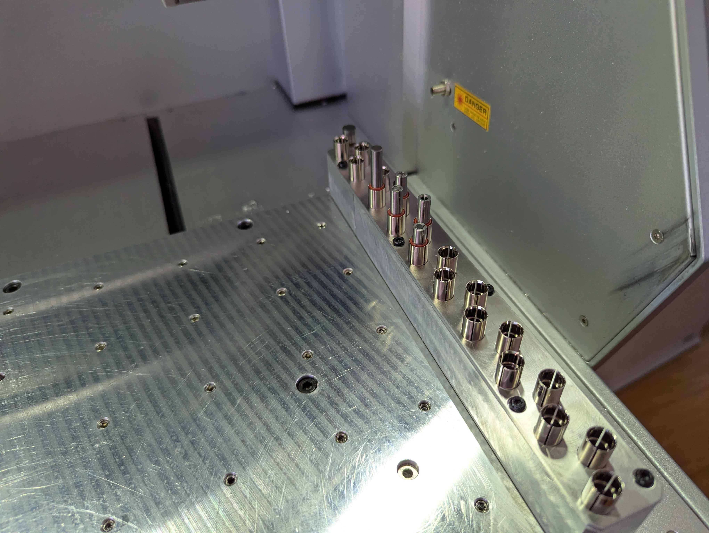

# Custom Tool Slots



This functionality enables the capability to configure up to 99 custom tool slots. If any custom tool slots are defined, the machine default slots are ignored. It's expected that you are either have defined all the slots, or are using the stock tool slots.

\
It is possible to define the stock tool slots if desired. This might be useful for a few reasons:

* if wanting to fine tune the tool slot or anchor 1 locations. Since the stock tool slot locations are configured as an offset from anchor 1, adjusting anchor 1 has the effect of also adjusting the tool rack location. This is not desirable. Custom tool slots are defined by the individual slot's X/Y/Z MCS location, and is not affected by changes in other machine positions.
* if you are supplementing the existing tool rack with additional slots.

Of course this functionality can be used to completely replace the Carvera tool rack with a higher slot count one.

<figure><figcaption><p>19 Slot Carvera Tool Rack made by <a href="https://serge.industries/shop">Serge Industries</a></p></figcaption></figure>

### Viewing the Tool Slot Config

The current tool slot configuration (stock or custom) can be viewed with the `M889` command.

```gcode
;Stock Carvera example
M889
Default Tool Slots Configuration:
Tool 0: X=-4.965 Y=-24.480 Z=-114.400
Tool 1: X=-4.965 Y=-84.480 Z=-114.400
Tool 2: X=-4.965 Y=-114.480 Z=-114.400
Tool 3: X=-4.965 Y=-144.480 Z=-114.400
Tool 4: X=-4.965 Y=-174.480 Z=-114.400
Tool 5: X=-4.965 Y=-204.480 Z=-114.400
Tool 6: X=-4.965 Y=-234.480 Z=-114.400

;Custom tools defined example
M889
Custom Tool Slots Configuration:
Tool 1: X=-11.450 Y=-21.525 Z=-117.000
Tool 2: X=-3.500 Y=-33.517 Z=-117.000
Tool 3: X=-11.330 Y=-45.550 Z=-117.000
Tool 4: X=-3.525 Y=-61.640 Z=-117.000
```

### Configuring Custom Tool Slots

Custom tool slots are configured using a hierarchical system with the top level config item `tool_slots` , with each tool slot having it's own index. This index value is also used as it's tool slot number identifier.

Each tool slot has a separate config elements for it's X/Y/Z Machine Coordinate System center position. \
\
Use config elements `tool_slots.T.x`, `tool_slots.T.y`, `tool_slots.T.z` to define the tool slot position, where `T` is the slot number. For example to configure slot 1's X value you would run  `config-set sd tool_slots.1.x -11.450` and `reset` to apply. Only slots with complete X/Y/Z configuration are considered valid and will be usable.

The best way to determine the MCS location of each tool slot is by using the [3D Probe](3d-probe-support.md) and performing a [bore probe (M461)](../supported-commands/mcodes/probing.md#m461-probe-bore-rectangular-pocket) inside the tool holder.

Note that the Z height configuration is the depth that the machine will lower the spindle before releasing the tool. It is recommended that at this height the tool holder is depressed into the spring mechanism by 1-2mm to ensure the tool is fully seated into the slot. The easiest way to get the right height is to use the original tool rack height as a baseline, and adjust up/down from there based on visual observation. Probing the inside lip of the slot is also possible however as the lip is very thin this can be challenging.

Note that tool 0 is a special slot for probes. Tools loaded as slot 0 have special behavior such as preventing the spindle from spinning. If no probes are stored in the rack, simply do not define a tool slot 0 in the custom tool slots definitions. There is no requirement that the slots are defined sequentially, only that the slot numbers do not exceed 99.
