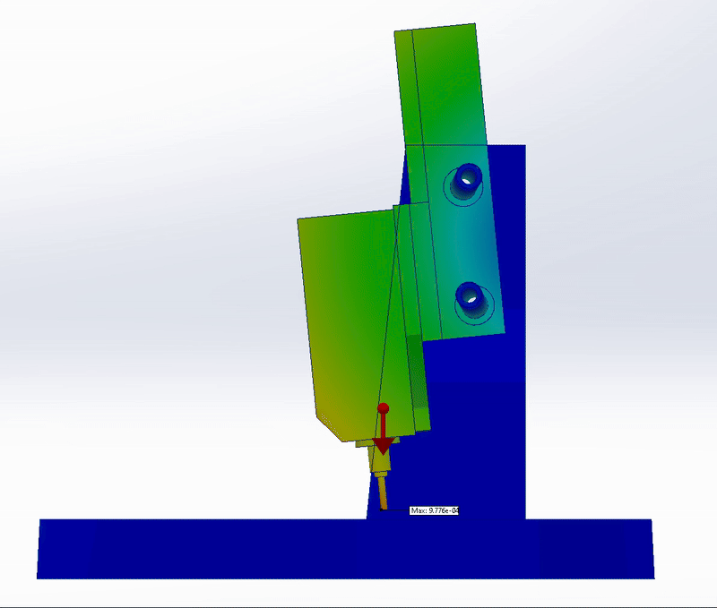
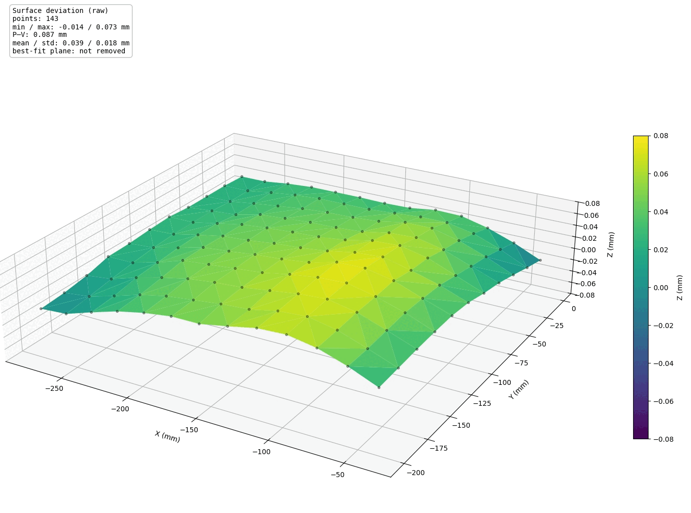

# Flex Compensation System


This feature requires the 3D touch probe to capture the flex profile


## Description

The linear rods of the **Carvera Air** are not rigid enough to precisely support the weight of the spindle and X-carriage. As a result, the spindle exhibits a slight tilting motion that becomes more pronounced when it is positioned near the center of the machine bed. This tilt causes deviations in both the Y and Z axes (cf. Fig. 1). Cutting a straight line from the leftmost position of the bed to the right side of the bed, the outcome would be a curve instead of a straight line, that bends towards the machine back. The same effect occurs on the Z axis, where the cut forms a curve that bows downward, since the spindle tilts more toward the bottom when located at the machine’s center.

<div align="center"><figure><figcaption><p>Figure 1: Exaggerated simulation of the x axis sag</p></figcaption></figure></div>

The **Flex Compensation System** compensates for this tilting motion with additional Y and Z movements similar to the bed leveling system. These movements are not reflected in either the machine or the work coordinate system, as they are compensation movements and therefore remain 'invisible'.

To use this feature the user has to perform a one time probing routine, recording the machine-specific spindle tilting profile. Ideally this profile spans over the entire X axis length. Afterwards this profile can be saved to the SD card and - if desired- the compensation program loaded upon every boot of the machine.\
\
**This flex compensation works separately to the bed leveling function, and both can be used at the same time. When flex compensation is active, it also applies to** [**probing operations**](../supported-commands/mcodes/probing.md) **as well.**

With the flex compensation enabled every single move that the machine executes is compensated in order to have the **Tool Center Point** (TCP) follow straight lines. Therefore all probing moves, including the bed leveling is compensated. Figure 2 shows a comparison of a full bed level of a [Saunders Machine Works (SMW) tooling plate](https://saundersmachineworks.com/products/makera-carvera-air-fixture-tooling-plate) before and after the flex compensation. The SMW has been used for this comparison as it has less surface deviations than the stock Carvera Air MDF bed.

<figure><figcaption><p>Figure 2: Visualization of a bed level before and after the flex compensation</p></figcaption></figure>

## Usage

Probing the machine specific flex profile is quite easy. There are only two prerequisites:

* 3D Touch Probe
* Straight reference geometry fixed on the bed

If you own the 4th axis you can unscrew the motor/chuck and the tailstock and use the base plate as your reference geometry. Please note that this is a good start but the front edge of the base plate isn't perfectly straight. For most users this is going to be precise enough.



#### Fix reference geometry on the bed

Put the reference geometry on the bed. If using the 4th axis baseplate, the plate is already aligned with dowel pins. If using something else, make sure to properly align it. Ideally the reference geometry exceeds the length of the bed (as the 4th baseplate does).



#### Position the probe tip at the leftmost position

Height should be right where you can confidently hit the reference geometry. Position the probe as far as it can go without running into hard or software endstops. The Y distance should be close to the reference geometry and < than the Y parameter specified in the G33 command. Fig 3. below shows and example of how the probe should be positioned

<figure><figcaption><p>Figure 3: Starting position for the G33 flex measurement command</p></figcaption></figure>



#### Run G33 command

Run the G33 command and let the machine do the measurement

Example:

```
G33 X303 Y10 I30
```

After the measurement has been finished the flex compensation is activated. Run M380.2 in order to save the data to the SD card.



#### (Optional) Activate the automatic loading of the compensation data

After the compensation data has been saved to the SD card, it can automatically be loaded after a clean start. Simply set the configuration value by running in the MDI:

```
config-set sd leveling-strategy.rectangular-grid.flex_compensation_always_active true
```



## Configuration Options


Machine configuration can be saved to the config.txt on the SD card with the command \`config-set sd \[key] \[value]\`. Once saved a machine reset is required to apply it.


```
leveling-strategy.rectangular-grid.flex_compensation_always_active [true/false]
```

With this setting the compensation data will be loaded on every reboot (recommended)

**Default**: false

```
leveling-strategy.rectangular-grid.flex_x_points 60
```

This value specifies the maximum number of points that can be probed along the X axis. Fewer points may be measured, but it is not possible to probe more than the configured amount.

**Default**: 60

## Commands

### G33 - Record flex profile

#### Description

Measure the flex along the x-axis by comparison with a reference

#### Parameters

* X: Specifies the total measurement distance
* Y: Specifies the Y distance to probe at each point
* I: Total number of probing points inside the total measurement distance

#### Example

```
G33 X303 Y10 I30
```

***

### M380 - Deactivate flex compensation

#### Description

Disable flex compensation

#### Parameters

None

#### Example

```
M380
```

***

### M380.1 - Print flex compensation

#### Description

Prints the currently active flex compensation data to MDI

#### Parameters

None

#### Example

```
M380.1
```

***

### M380.2 - Save compensation data to SD

#### Description

Stores the last recorded compensation profile to the SD card to be able to load it after a reboot

#### Parameters

None

#### Example

```
M380.2
```

***

### M380.3 - Load compensation data from SD

#### Description

Loads and activates the flex compensation data from the SD card

#### Parameters

None

#### Example

```
M380.3
```
