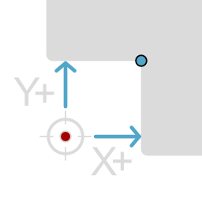
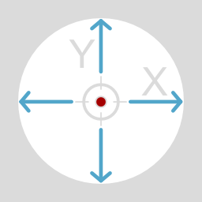
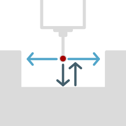
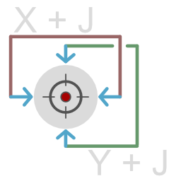
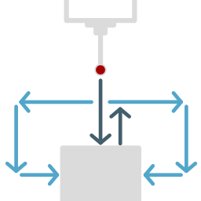
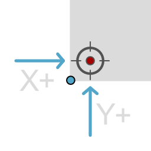
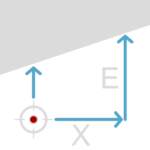
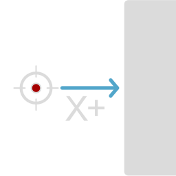

# Probing


This functionality requires a 3D Touch Probe


## Demonstration



## Probing Command Variables

When probing surfaces, a few variables are always set if the probing feature supports them

* \#153: the angle probed in degrees (if the angle is probed)
* \#154: X coordinate (if X axis was probed)
* \#155: Y coordinate (if Y axis was probed)
* \#156: Z coordinate (if Z axis was probed)

## Probing Image Breakdown

<figure><figcaption></figcaption></figure>

<figure><figcaption></figcaption></figure>

When selecting a probing operation in the controller the graphics have a set up standards\


* The probe start position is always denoted by a red dot, usually surrounded by a crosshair
* The final desired probe position is denoted by a blue dot if it is different than the starting crosshair
* Probing moves are denoted in bright blue with arrows
* Colored green, red, or dark blue lines denote dimension lines

## M460 - Probe Calibration

### Description

M460 performs probe calibration using different methods depending on the subcode. It can calibrate the probe using a bore (default), boss (subcode 2), or anchor (subcode 3).

This will save the value to variable #150. Use `config-set sd zprobe.probe_tip_diameter #` to store this value to the machine config.txt to use as the default and persistent beyond resets.

### Parameters

* X: Known diameter or radius in X direction (required for bore calibration)
* Y: Known diameter or radius in Y direction (required for bore calibration)
* Subcode 2: Use boss for calibration instead of bore
* Subcode 3: Use anchor 2 bracket for calibration

### Example

```
M460 X10 Y10         ; Calibrate probe using bore with 10mm diameter
M460.2 X10           ; Calibrate probe using boss with 10mm diameter
M460.3               ; Calibrate probe using anchor 2 bracket. Uses anchor_width 
                       config variable
```

## M460.1 - Calibrate Probe with Bore

### Description

M460.1 calibrates the probe tip diameter using a known bore diameter. The probe measures the bore multiple times and calculates the average to determine the probe tip diameter. Check MDI after running this command for console command to run.

### Parameters

* X: Known bore diameter in X direction (required)
* Y: Known bore diameter in Y direction (optional, defaults to X)
* R: Number of repeat measurements (optional, defaults to 1)
* S: Save position flag (optional)

### Example

```
M460.1 X10           ; Calibrate probe using 10mm bore diameter
M460.1 X10 Y10 R3    ; Calibrate with 3 repeat measurements
```

## M461 - Probe Bore/Rectangular Pocket

### Description

M461 probes a bore or rectangular pocket to find its center and measure its diameter. The probe moves in both positive and negative directions along the specified axes to find the edges, then calculates the center point and diameter. The initial probe down move will touch off on any surface it hits and retract slightly before probing sideways. If no surface is hit it will continue without retracting.

Ensure the probe is positioned at roughly the center of the bore before command execution.

When the macro completes the program will have saved the distance along the X axis as #151, the distance along the Y axis as #152, the center point in MCS as #154, #155.

All parameters are optional but you must have 1 of X or Y, if you supply only 1 of them it will only probe in that direction.

<figure><figcaption></figcaption></figure>

<figure><figcaption></figcaption></figure>

### Parameters

* X: Distance to probe in X direction (required)
* Y: Distance to probe in Y direction (required)
* D: Probe tip diameter (optional, defaults to configured value)
* E: Depth to probe sides from (optional, defaults to 2mm)
* H: Probe height above bore (optional, defaults to 0)
* C: Clearance height (optional, defaults to 2mm)
* F: Feed rate (optional, defaults to 300mm/min)
* K: Rapid feed rate (optional, defaults to 800mm/min)
* L: Number of repeat measurements (optional, defaults to 1)
* R: Retract distance (optional, defaults to 1.5mm)
* S: Save probed position (optional, defaults to 0)
* I: Invert probe for NC probe (optional, defaults to 0)

### Example

```
M461 X10 Y10           ; Probe 10mm in both X and Y directions
M461 X10 Y10 S1        ; Probe and save position as WCS origin
```

## M462 - Probe Boss/Rectangular Block

### Description

M462 probes a boss or rectangular block to find its center and measure its diameter. Unlike M461 (bore probing), this command probes the outside surfaces of a feature. The probe moves to the outside of the feature, then probes both sides to find the edges and calculate the center point and diameter. Any time the probe is moving downward during this function, if it hits a surface it will retract slightly

Ensure the probe is positioned at roughly the center of the boss/block before command execution.

When the macro completes the program will have saved the distance along the X axis as #151, the distance along the Y axis as #152, the center point in MCS as #154, #155.


<figure><figcaption></figcaption></figure>

<figure><figcaption></figcaption></figure>

### Parameters

* X: Distance to probe in X direction (required)
* Y: Distance to probe in Y direction (required)
* D: Probe tip diameter (optional, defaults to configured value)
* E: Depth to probe sides from (optional, defaults to 2mm)
* H: Probe height above boss (optional, defaults to 0)
* C: Clearance height (optional, defaults to 2mm)
* F: Feed rate (optional, defaults to 300mm/min)
* K: Rapid feed rate (optional, defaults to 800mm/min)
* L: Number of repeat measurements (optional, defaults to 1)
* R: Retract distance (optional, defaults to 1.5mm)
* S: Save probed position (optional, defaults to 0). If S1 is set the center of the boss will be the new xy origin. If S2 is set and a probing height (H) was given, the z origin is set to the probed surface
* I: Invert probe for NC probe (optional, defaults to 0)

### Example

```
M462 X10 Y10           ; Probe 10mm in both X and Y directions
M462 X10 Y10 S1        ; Probe and save position as WCS origin
```

## M463 - Probe Inside Corner

### Description

M463 probes an inside corner to find its position. The probe moves in both positive X and Y directions to find the corner edges, then calculates the corner position. This is useful for finding the exact position of inside corners in workpieces. Use negative Y/X values to direct which direction to probe.

Ensure the probe is positioned roughly diagonally inward from the corner before command execution.

When the macro completes the program will have saved the center position to #151 (X) and #152 (Y).

<figure><figcaption></figcaption></figure>

### Parameters

* X: Distance to probe in X direction (required)
* Y: Distance to probe in Y direction (required)
* D: Probe tip diameter (optional, defaults to configured value)
* E: Depth to probe sides from (optional, defaults to 2mm)
* H: Probe height above corner (optional, defaults to 0)
* C: Clearance height (optional, defaults to 2mm)
* F: Feed rate (optional, defaults to 300mm/min)
* K: Rapid feed rate (optional, defaults to 800mm/min)
* L: Number of repeat measurements (optional, defaults to 1)
* R: Retract distance (optional, defaults to 1.5mm)
* S: Save probed position (optional, defaults to 0). If S1 is set the corner will be the new xy origin. If S2 is set and a probing height (H) was given, the z origin is set to the probed surface
* I: Invert probe for NC probe (optional, defaults to 0)

Example

```
M463 X10 Y10           ; Probe 10mm in both X and Y directions
M463 X10 Y10 S1        ; Probe and save position as WCS origin
```

## M464 - Probe Outside Corner

### Description

M464 probes an outside corner to find its position. The probe moves to the outside of the corner, then probes in both positive X and Y directions to find the corner edges. This is useful for finding the exact position of outside corners in workpieces.

Ensure the probe is positioned roughly diagonally outward from the corner  before command execution.

When the macro completes the program will have saved the center position to #151 (X) and #152 (Y).

<figure><figcaption></figcaption></figure>

### Parameters

* X: Distance to probe in X direction (required)
* Y: Distance to probe in Y direction (required)
* D: Probe tip diameter (optional, defaults to configured value)
* E: Depth to probe sides from (optional, defaults to 2mm)
* H: Probe height above corner (optional, defaults to 0)
* C: Clearance height (optional, defaults to 2mm)
* F: Feed rate (optional, defaults to 300mm/min)
* K: Rapid feed rate (optional, defaults to 800mm/min)
* L: Number of repeat measurements (optional, defaults to 1)
* R: Retract distance (optional, defaults to 1.5mm)
* S: Save probed position (optional, defaults to 0). If S1 is set the corner will be the new xy origin. If S2 is set and a probing height (H) was given, the z origin is set to the probed surface
* I: Invert probe for NC probe (optional, defaults to 0)

### Examples

```
M464 X10 Y10           ; Probe 10mm in both X and Y directions
M464 X10 Y10 S1        ; Probe and save position as WCS origin
```

## M465 - Probe Axis Angle

### Description

M465 probes two points to find an angle relative to the X or Y axis. The probe measures two points along a surface and calculates the angle between them. This is useful for measuring angles of surfaces, edges, or features on workpieces.

When the macro completes the program will have saved angle as degrees to #153

<figure><figcaption></figcaption></figure>

### Parameters

* X: Distance to probe in X direction (optional, only one of X or Y should be specified)
* Y: Distance to probe in Y direction (optional, only one of X or Y should be specified)
* D: Probe tip diameter (optional, defaults to configured value)
* E: Depth to probe sides from (optional, defaults to 2mm)
* H: Probe height above surface (optional, defaults to 0)
* C: Clearance height (optional, defaults to 2mm)
* F: Feed rate (optional, defaults to 300mm/min)
* K: Rapid feed rate (optional, defaults to 800mm/min)
* L: Number of repeat measurements (optional, defaults to 1)
* R: Retract distance (optional, defaults to 1.5mm)
* S: Save probed position as WCS Rotation (optional, defaults to 0)
* I: Invert probe for NC probe (optional, defaults to 0)
* V: Visualize path distance (optional, defaults to 0)

#### Examples

```
M465 X10              ; Probe 10mm in X direction to find angle
M465 Y15              ; Probe 15mm in Y direction to find angle
M465 X20 V5           ; Probe with 5mm visualization path
```

## M466 - Single Axis Probe Double Tap

### Description

M466 performs a single axis probe with double tap functionality. It probes along one or more axes (X, Y, or Z) and can repeat the measurement multiple times for accuracy. The probe moves in the specified direction until it contacts the surface, then calculates the final position.

When the macro completes the program will have save the result to:

* \#154: X coordinate (if X axis was probed)
* \#155: Y coordinate (if Y axis was probed)
* \#156: Z coordinate (if Z axis was probed)


<figure><figcaption></figcaption></figure>

### Parameters

* X: Distance to probe in X direction (optional)
* Y: Distance to probe in Y direction (optional)
* Z: Distance to probe in Z direction (optional)
* D: Probe tip diameter (optional, defaults to configured value)
* E: Depth to probe sides from (optional, defaults to 2mm)
* H: Probe height above surface (optional, defaults to 0)
* C: Clearance height (optional, defaults to 2mm)
* F: Feed rate (optional, defaults to 300mm/min)
* K: Rapid feed rate (optional, defaults to 800mm/min)
* L: Number of repeat measurements (optional, defaults to 1)
* R: Retract distance (optional, defaults to 1.5mm)
* S: Save probed position (optional, defaults to 0). If S1 is set the single probed x or y axis will be set as the WCS origin. If S2 is set the z origin is set to the probed surface
* I: Invert probe for NC probe (optional, defaults to 0)

### Example

```
M466 X10              ; Probe 10mm in X direction
M466 Y15              ; Probe 15mm in Y direction
M466 Z5               ; Probe 5mm in Z direction
M466 X10 Y10          ; Probe 10mm in both X and Y directions
M466 X10 Y10 Z5 S1    ; Probe and save position as WCS origin
```
