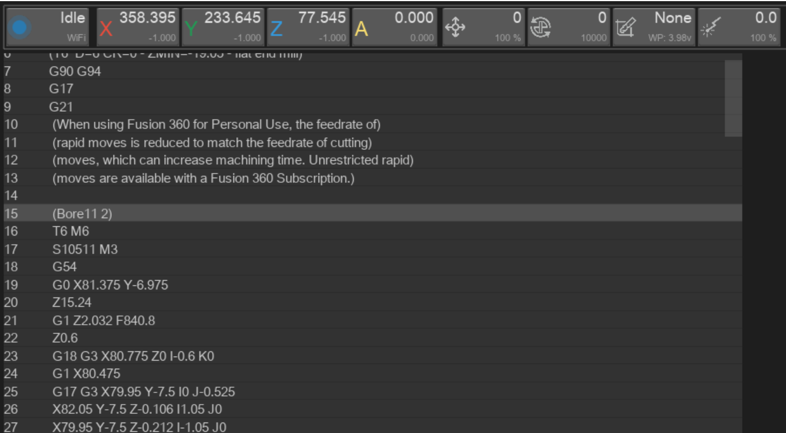
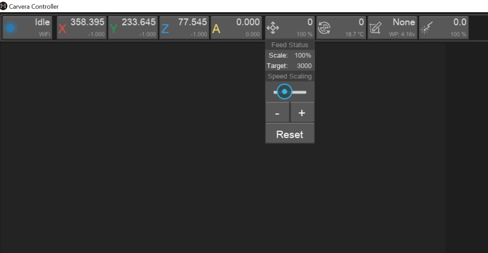
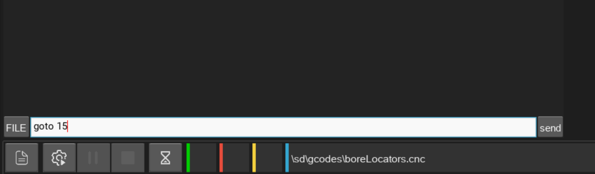

# Start from Middle of File

This guide goes over how to start a program from the middle of a gcode file. This is a more advanced process and is best accomplished if you can read and understand a gcode file as it can lead to crashing your machine.

1. Find which line in your gcode you want to start from. If you hit the estop button, the gcode reader will have the last line highlighted. Otherwise you can open the file in notepad and search for the tool or operation, highlight that particular line and notepad will display the line number across the bottom. Once you have the rough location you want to start from, it is best to move backward to the last operation (often denoted by parenthesis) or tool change (the line will start with T) to avoid crashing your machine.\
   In the example below, I will be starting from line 15

<figure><figcaption></figcaption></figure>

2. Load the program you want to start. Use the machine jogging tools to make sure the cutting bit is in a safe location.
3. Set your feedrate to its lowest value by clicking the feed dropdown and dragging the speed scaling to the left/clicking the minus button. This helps avoid crashes

<figure><figcaption></figcaption></figure>

4. start your program. If you have milled into your probing position, disable auto z-probe and auto level. auto z probe is persistent when shutting the machine off. If you are using auto leveling and have shut your machine off since the leveling was run, that information is lost and you will need to re-auto level. If the top surface is not suitable for leveling you can try to run the program without it, or you will have to restart from with new stock.
5. once the program starts running, hit the pause button in your controller. The machine will finish its current buffer of moves and stop. The spindle will most likely continue running.
6. Once the machine has stopped moving, make sure the tool bit is safely above the workpiece. You can use the jog buttons to move it up along the z axis. This is to prevent crashes
7. click the MDI button (it will change to say file). This is an input terminal
8. type “goto 15” into the bar that says enter command… , substituting 15 with the line number you wish to start from. Hit enter/the send button

<figure><figcaption></figcaption></figure>

9. click the button that says file to return to your gcode display. It should have the line number you want to start from highlighted. Double check that the line number is correct and your machine is clear of the workpiece if it starts moving in an unexpected way. Be ready with the estop after this point
10. Run the program by hitting the play button (third from the left) and watch carefully until you feel confident it will not crash
11. Once you are confident the machine is operating as expected, open the feed dropdown and set your feedrate back to 100% using the plus button (or another value if you are running fast or slow)
