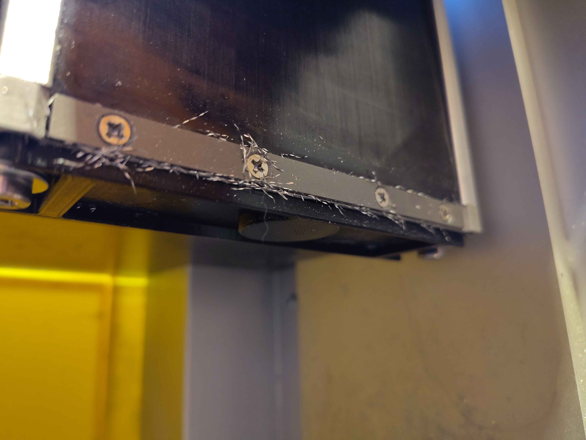

# C1 Z axis leadscrew bottom cover

\
\
[https://www.printables.com/model/1584622-carvera-makera-c1-z-axis-lead-screw-bottom-cover](https://www.printables.com/model/1584622-carvera-makera-c1-z-axis-lead-screw-bottom-cover)\
\
the bottom of the z axis lead screw on the machine is exposed and quickly fills with chips in an unhealthy way.\
\
I printed mine in PETG but most any filament will do. Two short M5 bolts attach using existing holes. I used M5x5\
\
\
Mod author: Fae Corrigan
