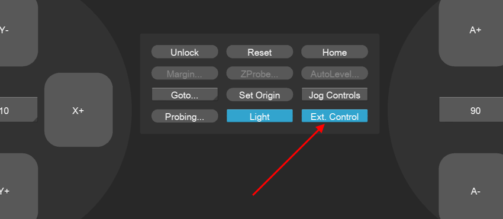
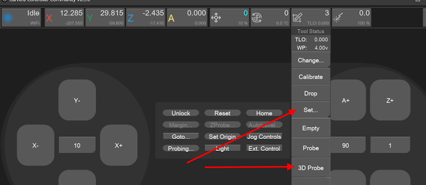
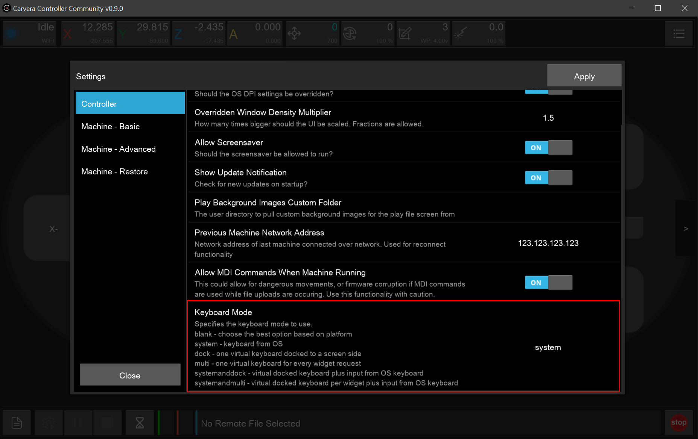
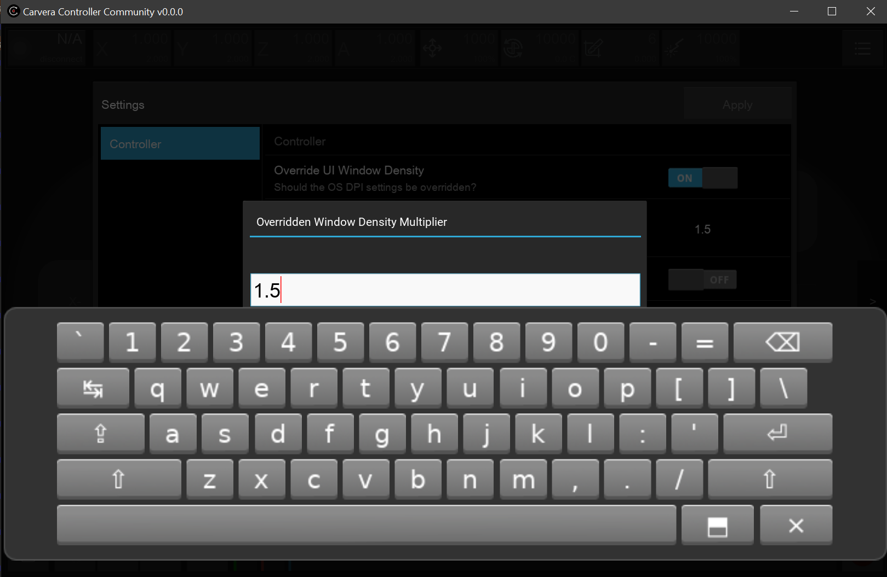
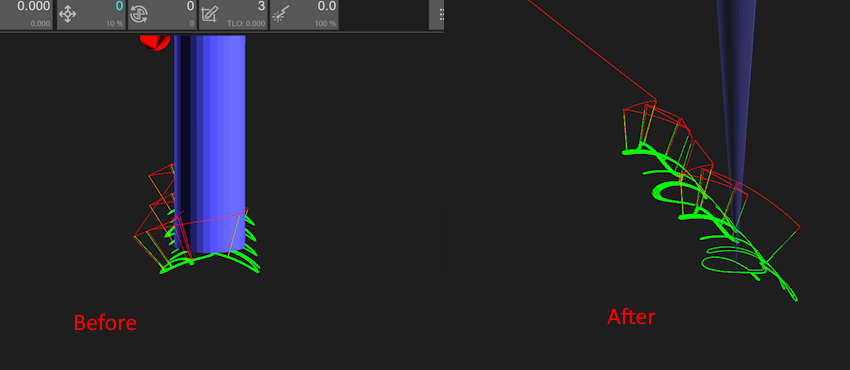
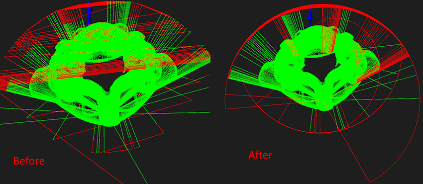
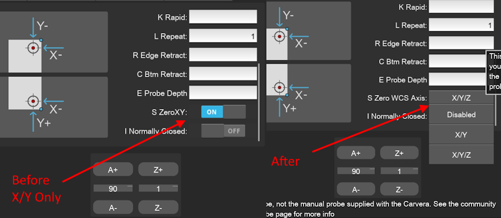
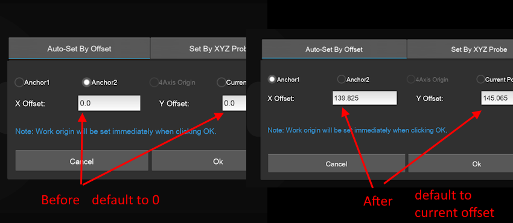
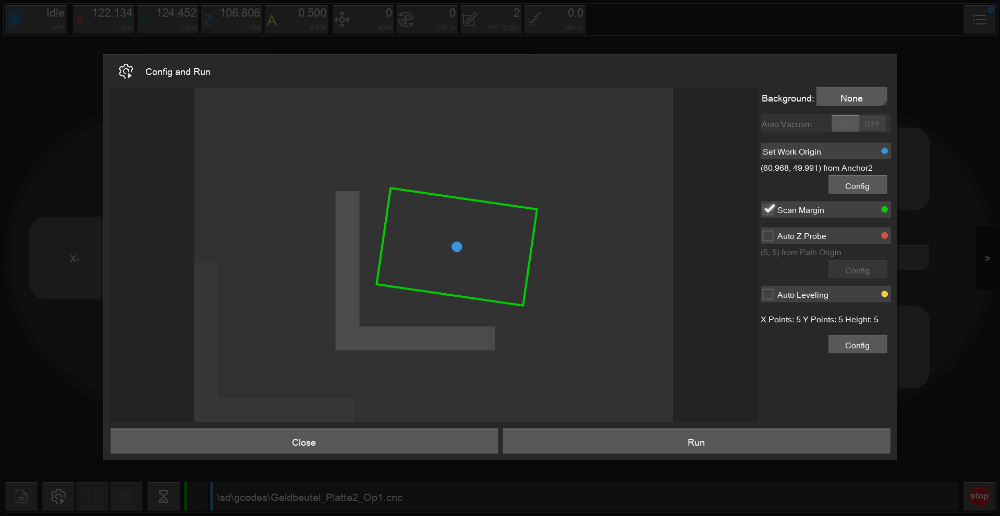

# Controller v0.9.0

🎉🎉Version v0.9.0 of Carvera Controller Community is NOW AVAILABLE!🎉🎉

Download: [https://github.com/Carvera-Community/Carvera\_Controller/releases/tag/v0.9.0](https://github.com/Carvera-Community/Carvera_Controller/releases/tag/v0.9.0)&#x20;

This release is the first Community Controller version with an Android package. Thank you @Warioo for working on this! Download the apk from the release page.&#x20;

This initial version for Android requires Android 11 or higher running ARM 32-bit processors (ARMv7a). Currently 64-bit processors (ARMv8a) are not supported.&#x20;

Please note when using the file browser in the Controller, the app will guide you to a permission page of android where you have to grant the app full access to your android devices files. Without this you will not see any files.&#x20;

Be aware that there is a known bug in one of the libraries used for graphics rendering, this can result in the screen stay black after starting the app. Until this is resolved in the upstream library we have implemented a workaround to try to prevent this from occuring. If you still encounter this issue, you then need to go to the home screen and back to the app. Please give feedback via github issue if this occurs for you.

<figure><figcaption></figcaption></figure> <figure><figcaption></figcaption></figure> <figure><figcaption></figcaption></figure> <figure><figcaption></figcaption></figure> <figure><figcaption></figcaption></figure> <figure><figcaption></figcaption></figure> <figure><figcaption></figcaption></figure> <figure><figcaption></figcaption></figure> <figure><figcaption></figcaption></figure>

