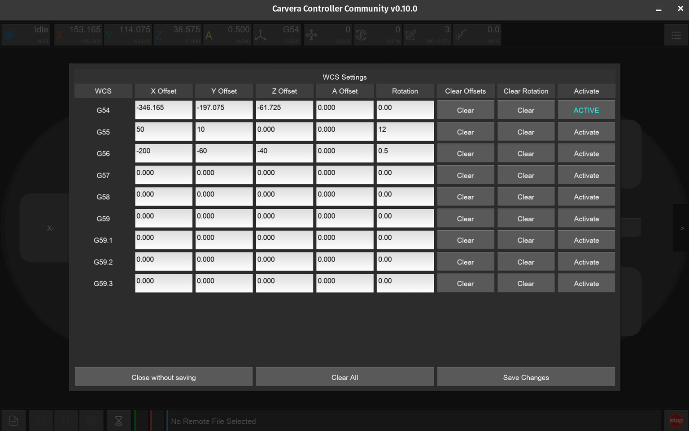
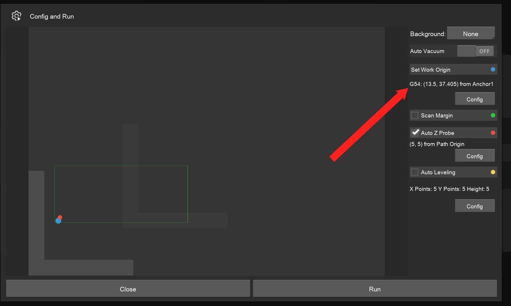
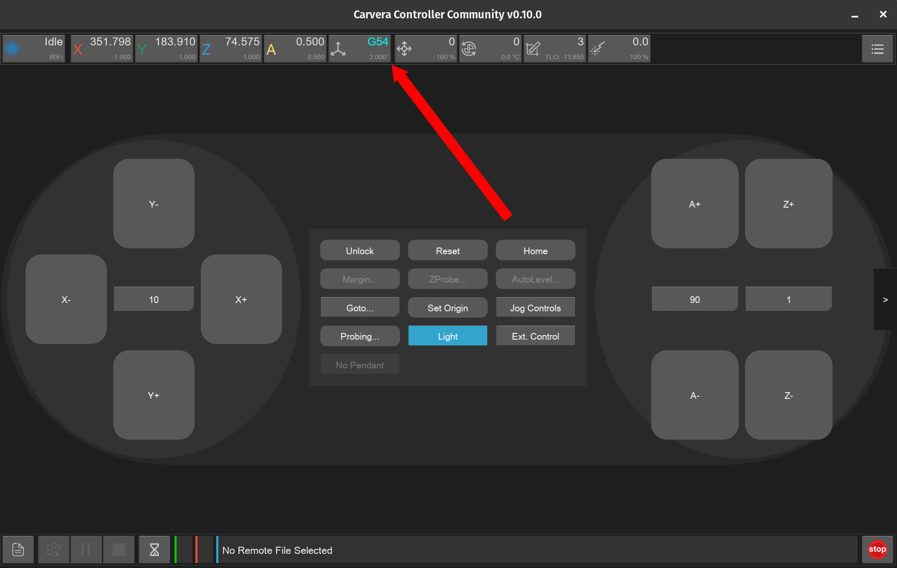
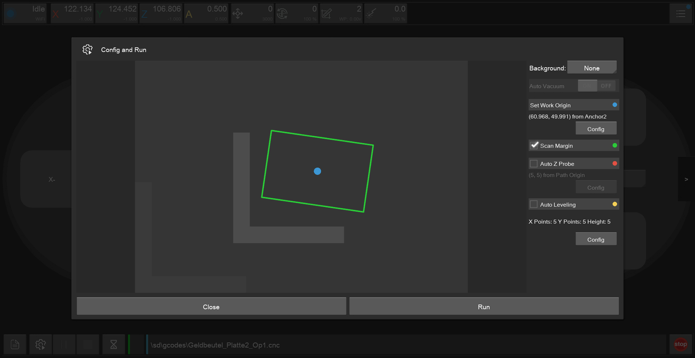
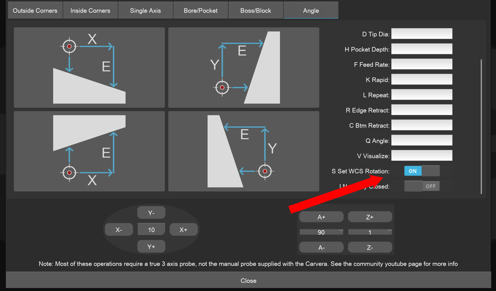
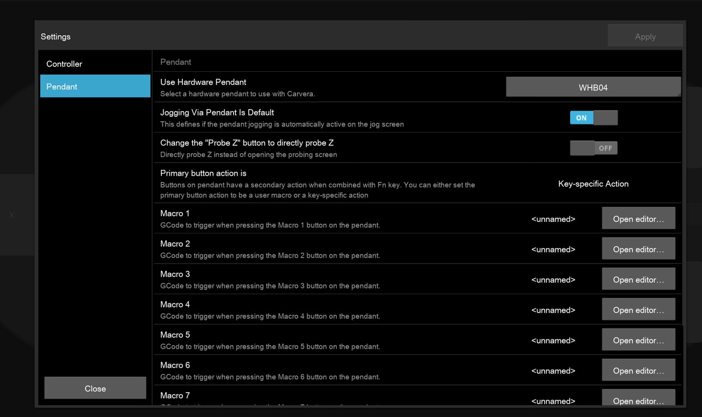
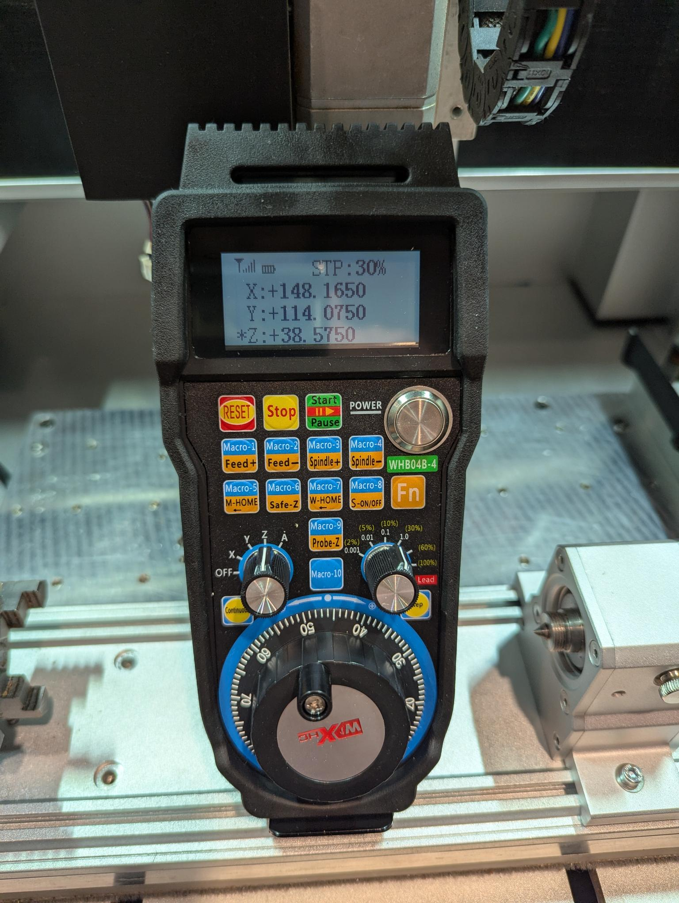
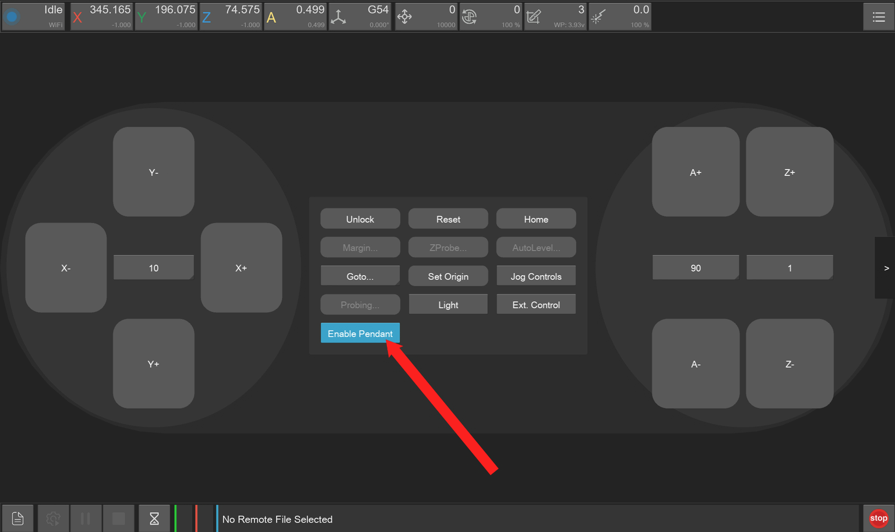

# Firmware 1.0.9c and Controller v0.10.0

Today we release Carvera Community Firmware 1.0.9c and v0.10.0 of the Community Controller! These projects are not affiliated with Makera, and exists to go above and beyond what is provided by the OEM software.&#x20;

Please see the release notes on GitHub for downloads and full details:&#x20;

Carvera Community Firmware 1.0.9c - [https://github.com/Carvera-Community/Carvera\_Community\_Firmware/releases/tag/1.0.9c](https://github.com/Carvera-Community/Carvera_Community_Firmware/releases/tag/1.0.9c)&#x20;

Carvera Community Controller 0.10.0 - [https://github.com/Carvera-Community/Carvera\_Controller/releases/tag/v0.10.0](https://github.com/Carvera-Community/Carvera_Controller/releases/tag/v0.10.0)

## Key features in these releases

### **Workspace Management**&#x20;

As you know the machine uses different Coordinate systems, commonly referenced as Work Coordinate System (WCS) and Machine Coordinate System (MCS). But did you know its possible to have multiple Work Coordinate Systems? The default WCS is called G54, but others are availiable via G55-G59.3. When using Carvera Community Firmware 1.0.9c together with v0.10.0 of the Community Controller you can now easily change between the different WCS systems via the Top Bar, and advanced WCS management screens. Each WCS will store it's own offsets to EEPROM. Multiple WCS are useful for:

* Running different setups or fixtures: You can quickly switch between different parts or jigs without having to re-probe or redefine zero locations.
* Repeating jobs in multiple locations: If you have several identical parts on the same machine bed, you can assign each one a different WCS (e.g., G54 for part 1, G55 for part 2), speeding up the workflow and reducing setup errors.
* Managing multi-operation projects: For complex jobs requiring multiple machining operations or tool changes, you can assign each operation its own WCS, making it easier to maintain consistency.
* Training and testing: Multiple users can each have their own WCS for testing and practice without interfering with each other’s offsets.

<figure><figcaption></figcaption></figure> <figure><figcaption></figcaption></figure> <figure><figcaption></figcaption></figure>

### **WCS Rotation Support**&#x20;

If you are using a vise you will know that you need to tram the workholding to be parallel with the machine's X/Y axis, otherwise the workpiece will experience misalignment during machining, resulting in out-of-square parts, inaccurate features, and potential clamping issues that can compromise both dimensional accuracy and part quality. No more! With this release of the Controller/Firmware a 3D Probe can be used to determine the stock rotation and correct the machine movements entirely in software without needing to make any physical changes. This WCS rotation is even applied for subsequent probing operations.


Demonstration of the use of Rotated WCS


<figure><figcaption></figcaption></figure> <figure><figcaption></figcaption></figure> <figure><figcaption></figcaption></figure>

### **Pendant Support**&#x20;

A frequently requested feature is the ability to control the machine with a hand held pendant device with physical switches and knobs for precise movement. With this release the Community Controller supports the WiXHC WBH04 family of pendants. With this device you can jog the spindle, run macros, tweak the spindle speed/feed overrides, pause/resume gcode playback.

<figure><figcaption></figcaption></figure> <figure><figcaption></figcaption></figure> <figure><figcaption></figcaption></figure>

### **Fixes and Tweaks**&#x20;

This version of software has also a large number of fixes and tweaks. Notably:&#x20;

* Disabling access to Controller functionality that requires the Community firmware if Community Controller used without it&#x20;
* Improvements to the Android version expanding CPU architecture support, Topbar sizing, and blank screen handling
* No more corrupted G54-G59 offsets for Z and A axis after switching to the community firmware from stock
* Improved Carvera Air support including showing CA1 specific settings in the Controller, and including the 3D Probe tool option to Change/Set dropdown
* Linux docker container support for advanced users that want to run the Controller on a server and access the Controller via Web browser&#x20;

As this release has a number of larger features, we are starting to write long form documentation on our docs site: [https://carvera-community.gitbook.io/docs/](https://carvera-community.gitbook.io/docs/). Please check back here for more details in future.
