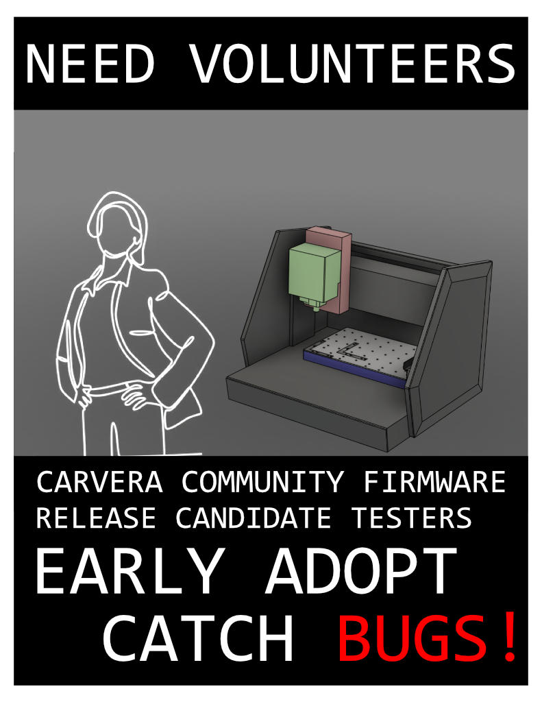

# Firmware/Controller 2.0.0c-RC1

Today we release a new Release Candidate of the Carvera Community Firmware and Controller! These projects are not affiliated with Makera, and exist to go above and beyond what is provided by the OEM software.&#x20;

### **Release Schedule Changes**

Moving forwards the Carvera Community projects are going to make available new feature releases first as Release Candidates (RC) for a period of time for testing by the wider community before subsequent releases. We ask operators using these releases to provide feedback positive and negative about how they are finding the new functionality in either the ⁠mods channel of the [Makera Discord](https://discord.gg/c6UMjEhaQA) or #feedback in the Carvera Community Discord. Release candidates are feature locked and thoroughly tested by the community dev team and are designed to catch any minor edge case errors that crop up when expanding the user base before a full release. Thank you in advance to anyone who has the time to help catch the final round of bugs.

### **New version milestone!**

We feel that so much functionality has been added to the Community Firmware and Controller beyond the OEM that the version 2.0.0 milestone is warranted. Please note that this is still an incremental release and there are no breaking changes from the previous versions.

### **New functionality highlights of 2.0.0c-RC1**

Full details to come in the 2.0.0c release. Here is a taste for those interested in testing the Release Candidate:

* [**The Community projects documentation site**](https://carvera-community.gitbook.io/docs/) is live!
* [**Continuous Jog Mode**](https://carvera-community.gitbook.io/docs/firmware/features/jog-modes) - Capability to move at a continuous speed without specifying direction has been added to the firmware and supported in the Controller
* [**Carvera Air Flex Compensation System**](https://carvera-community.gitbook.io/docs/firmware/features/flex-compensation-system) - Automated x-rod flex measurement and compensation. This improves the stock machine’s accuracy by up to 0.05mm in the Z/Y axis in the middle of the x-rail.
* 3D Probe Crash Protection - When jogging the spindle with the 3D Probe attached, movement is prevented if the Probe triggers. This prevents destruction of the probe tips.
* [**Auto-Reconnect capability in the Controller**](https://carvera-community.gitbook.io/docs/controller/features/auto-reconnect) - The controller will automatically reconnect if the connection to the machine is lost.
* [**Configurable Macro buttons**](https://carvera-community.gitbook.io/docs/controller/features/macros) - Short snippets of gcode can now be saved for execution via 3 dedicated macro buttons on the main control panel

Full list of changes is available on GitHub:

* [Carvera Community Firmware 2.0.0c-RC1](https://github.com/Carvera-Community/Carvera_Community_Firmware/releases/tag/v2.0.0c-RC1)
* [Carvera Community Controller 2.0.0-RC1](https://github.com/Carvera-Community/Carvera_Controller/releases/tag/v2.0.0-RC1)

<figure><figcaption></figcaption></figure>
