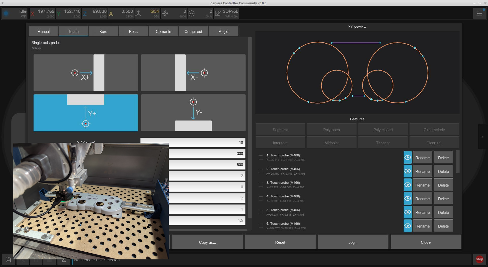
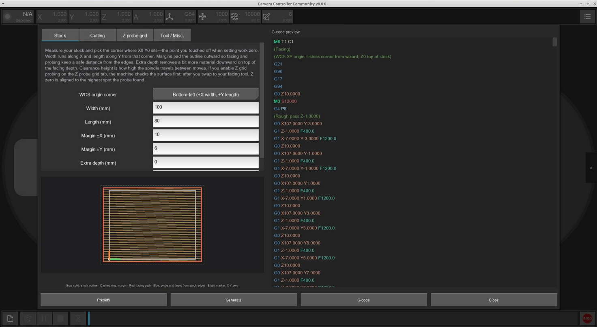

# Firmware/Controller 2.2.0c-RC1

Today we release the Release Candidate for 2.2.0 of the Carvera Community Firmware and Controller! This is another feature dense release culminating from 4 months of development.

We ask operators using these releases to provide feedback, positive and negative, about how they are finding the new functionality in either the mods channel of the [Makera Discord](https://discord.gg/c6UMjEhaQA) or #feedback in the Carvera Community Discord.&#x20;

Release candidates are feature locked and thoroughly tested by the community dev team, and are intended for catching any minor edge-case errors that crop up when expanding the user base before a full "marked stabled" release in the coming weeks.

You can download the releases and see the full changelog on GitHub:

* [Carvera Community Firmware 2.2.0c-RC1](https://github.com/Carvera-Community/Carvera_Community_Firmware/releases/tag/v2.2.0c-RC1)
* [Carvera Community Controller 2.2.0-RC1](https://github.com/Carvera-Community/Carvera_Controller/releases/tag/v2.2.0-RC1)

## Release highlights

#### CMM Workbench

A dedicated [CMM Workbench UI](firmware-controller-2.2.0c-rc1.md#cmm-workbench) turns the 3D Probe into a reverse-engineering tool. Probe corners, bores, bosses, angles, and related features into a 2D sketch, construct derived geometry (segments, midpoints, intersections, tangents, and more), then export the result as CSV / DXF / JSON.&#x20;

<figure><figcaption></figcaption></figure>

#### Facing Wizard

The [Facing Wizard ](firmware-controller-2.2.0c-rc1.md#facing-wizard)generates a facing toolpath from stock size, tool, stepover, depth, and milling direction right inside the Controller. No CAM needed :smile: Optionally it can probe a Z grid first so facing starts from the highest point on the stock.

<figure><figcaption></figcaption></figure>

#### G-Code Viewer Improvements

The [G-code viewer](firmware-controller-2.2.0c-rc1.md#g-code-viewer-improvements) has received a large set of upgrades:

* View cube, orthographic projection, machine grid overlay, and colour schemes (by move type, tool, feed, or Z height)
* Syntax highlighting in the file viewer (colours customisable in Settings)
* Tool-change markers on the playback progress bar
* Tool definitions read from supported post-processor outputs (Fusion 360 Community, Makera Studio, FreeCAD Community) for accurate 3D tool meshes, toolbar icons, tooltips, and manual tool-change prompts
* Live camera view for the Makera Z1 (resolution and brightness/contrast/gamma adjustable while streaming)

<figure><figcaption></figcaption></figure>

#### Gamepad Pendant Support

In addition to WHB04-family hardware, the Controller now supports standard [gamepads as pendants](../controller/features/pendant-support.md) (Xbox / PlayStation-style and similar HID joysticks). Configure under Settings → Pendant, with presets for common layouts and customisable bindings, deadzone, max jog speed, and per-axis invert.

#### Advanced TLO Calibration

[Advanced TLO Calibration](firmware-controller-2.2.0c-rc1.md#advanced-tlo-calibration) (“Adv Calibrate” in the Tool dropdown) runs `M491` with optional X/Y offset from the tool setter and a repeat count. This is essential for probing face mills that not-center cutting and require being offset from the tool setter.

#### Auto Ext. Out

An [Auto Ext. Out](firmware-controller-2.2.0c-rc1.md#auto-ext.-out) feature has been exposed in the spindle dropdown and Config and Run screen. This turns on devices connected to the extend port (vacuum, compressor, etc.) whenever the spindle is running.

#### Connection & Protocol

[Connection handling](../controller/features/connection-and-protocol.md) is substantially more robust:

* Autodetect Smoothie vs Makera communication protocol on connect and use it for the session
* USB device list filtered to Makera FTDI devices; devices remembered by stable identity rather than COM path
* Progress popup while opening USB; reconnect works for USB as well as WiFi
* Preferred connection method for app-launch auto-connect; last successful method used after a drop
* Manual **Network…** address entry under Scan Wi-Fi
* `reset` over USB is blocked with a prompt to use the power switch instead

On the firmware side, [the communication protocol is now selectable](../firmware/features/communication-protocol.md) and defaults to the newer Makera style. This allows the Community firmware to work with Makera Studio at a basic level. Makera probing commands M480.1–M480.10 are implemented as wrappers around the community probing macros.

#### 4th Axis Centre Calibration (M469.6)

A new [M469.6 self-calibration routine](../firmware/supported-commands/mcodes/self-calibration.md#m469.6-calibrate-a-axis-centre-of-rotation) finds the true 4th-axis centreline in Y and Z by probing a round artifact (such as the chuck body) from multiple directions. Unlike the previous headstock calibration, it is not skewed by runout or surface imperfections, and is the recommended replacement for M469.4 / M469.5 for setting rotation offsets.

#### C1 Improved PID Spindle Control

Carvera C1 owners can switch to a [improved PID spindle control](firmware-controller-2.2.0c-rc1.md#c1-improved-pid-spindle-control) code (`spindle.type pid_pwm`) and gain up to 2× better spindle performance and torque under load. No electronic modifications required. Follow the documentation guide for recommended config values and optional motor-controller knob adjustments. Not for Air or Z1 (those already use external closed-loop motor controllers).

#### O-Codes

Firmware now supports a subset of [LinuxCNC-style O-codes](firmware-controller-2.2.0c-rc1.md#o-codes) for conditionals, loops, and in-file subroutines when playing a file. Useful for parametric jobs and logic that previously needed external CAM or macros.

#### Hardware Health Checks

Two [new diagnostic commands](firmware-controller-2.2.0c-rc1.md#hardware-health-checks) help catch mechanical and media problems early:

* [M575](../firmware/supported-commands/mcodes/hardware-health-checks.md#m575-endstop-repeatability-test) - Endstop repeatability test
* [M576](../firmware/supported-commands/mcodes/hardware-health-checks.md#m576-check-all-hashed-files) - SD card file integrity check against stored MD5 hashes

#### Spindle Suspend / Resume

On pause, the firmware can save spindle state, stop the spindle, and restore speed on resume only if it was running. Enabled by default; disable with `config-set sd spindle_suspend_restore_enable false` if you prefer the previous behaviour.

#### iPhone & Initial Z1 Support

The Controller now builds for iPhone (iOS 17.6+), alongside the existing iPad support. Initial Makera Z1 support in the Controller is also in this release, including the [live camera view](../controller/features/gcode-viewer.md#z1-camera) in the G-code viewer. However please note that full Z1 support will not be ready until next release, there is still a lot more work to be done.

#### WiFi AP Auto-Disable & Debug Mode

When the machine joins an external WiFi network, the [on-board AP is turned off automatically](../firmware/features/wifi-ap-auto-disable.md) by default (`wifi.ap_auto_disable`). A new `debugmode` console command exposes [continuous firmware diagnostics](../firmware/features/debug-mode.md) (`slowticker`, `cpuload`, and related modes) for troubleshooting.

#### General UI Improvements

* [Green **?** help buttons ](../controller/common-error-messages.md)throughout the UI link to the relevant documentation page
* Multi-select in the remote file browser
* Halt popup now shows the error message (firmware errors are standardised as `ERROR: …`)
* Warning when running stock firmware, or when the Controller version is older than the firmware
* Resume-at-line warns if the recovery sequence is missing a tool change, feed rate, or spindle speed
* Probing panels show the configured probe tip diameter
* Significant Controller resource usage reduction by checking if any UI has updated, and only rendering changes
* Stability improvements in the Controller threads
